<p align="center">
  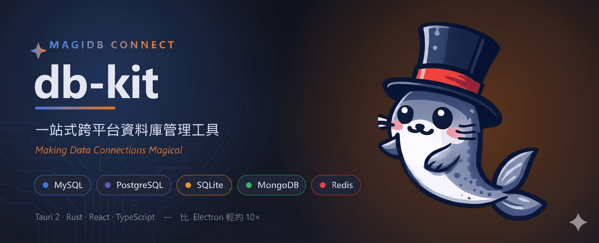
</p>

<h1 align="center">db-kit</h1>

<p align="center"><strong>MAGIDB CONNECT — Making Data Connections Magical</strong></p>

<p align="center">
One interface for <strong>MySQL · MariaDB · PostgreSQL · SQL Server · Oracle · SQLite · MongoDB · Redis · Kafka · Elasticsearch · RabbitMQ</strong>,<br>
with <strong>SSH / SFTP / FTP · Docker · Kubernetes · Remote desktop · File compare</strong> in the same window.
</p>

<p align="center">
  
  
  
  
  
</p>

<p align="center">
  <strong>💚 100% Free & Open Source</strong>　·　MIT License　·　No paywall　·　No telemetry
</p>

<p align="center">
  <a href="./README.md">繁體中文</a> · <strong>English</strong>
</p>

---

## What is this

**db-kit** is a desktop database tool for Windows / macOS / Linux. Relational, document, key-value, message queue and search engine connections share one connection tree, data grid, query editor and set of shortcuts; the SSH, container and remote desktop tools you open while chasing a problem live in the same sidebar.

- **Lightweight**: Tauri 2 (Rust backend + system WebView), roughly one tenth the memory of comparable Electron apps.
- **Safe**: passwords and API keys live only in the OS keychain; writes are fully parameterized and located by primary key; connections can be read-only and color-tagged per environment.
- **Optional AI**: use a local Claude Code / Codex CLI or any Anthropic / OpenAI-compatible API. The assistant only ever reads from the database; writes go through Review & Run first. It also works the other way round as an **MCP server**, so Claude Code / Codex / Cursor / VS Code can query your databases directly.
- **CLI included**: `dbk` reuses the same connections to query, export, back up and compare from a server.

## Screenshots

<p align="center">
  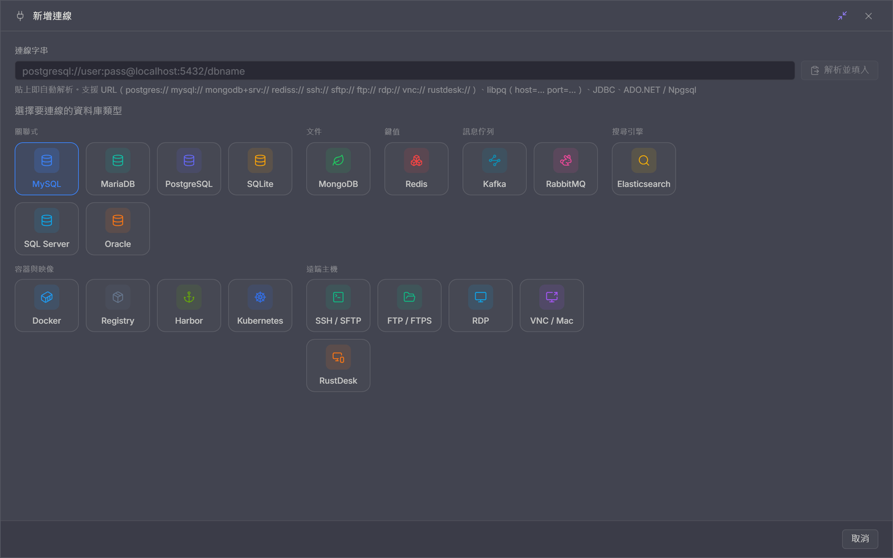
</p>

| Table view | Query editor (multiple result sets) |
|:---:|:---:|
| 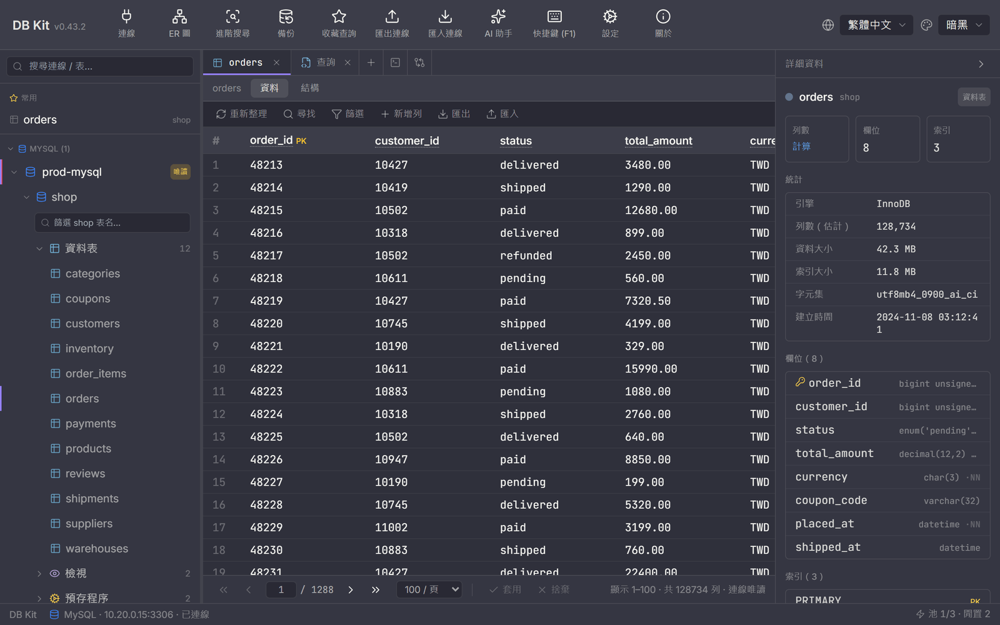 | 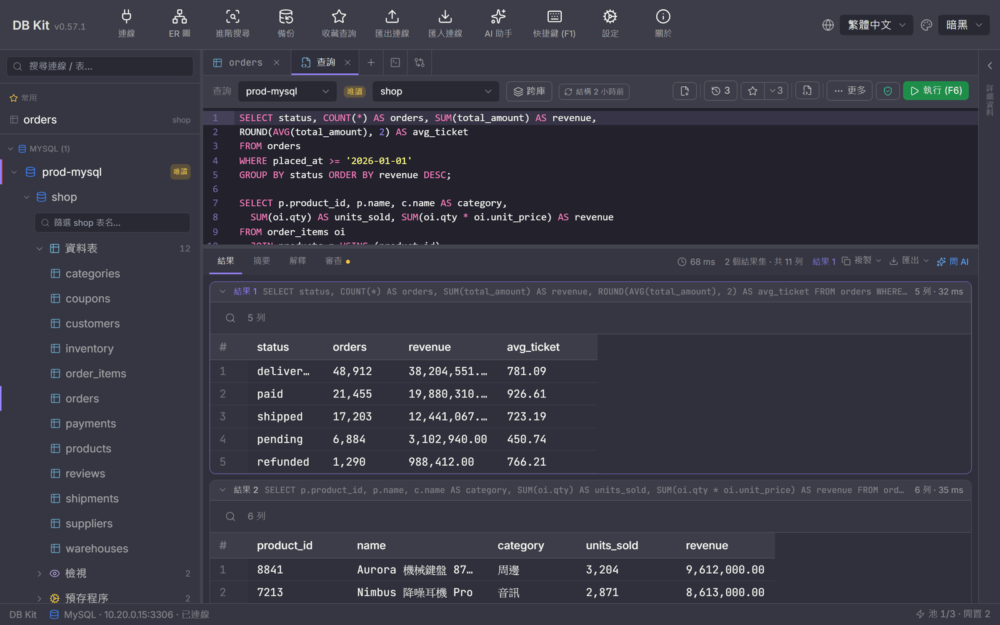 |
| **ER diagram** | **Redis** |
| 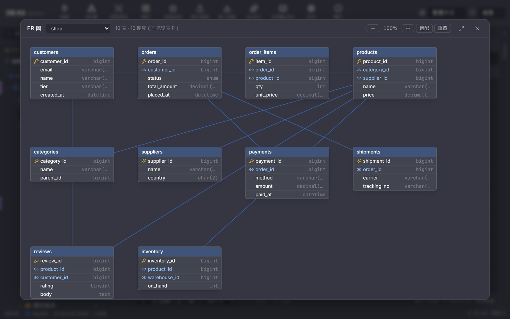 | 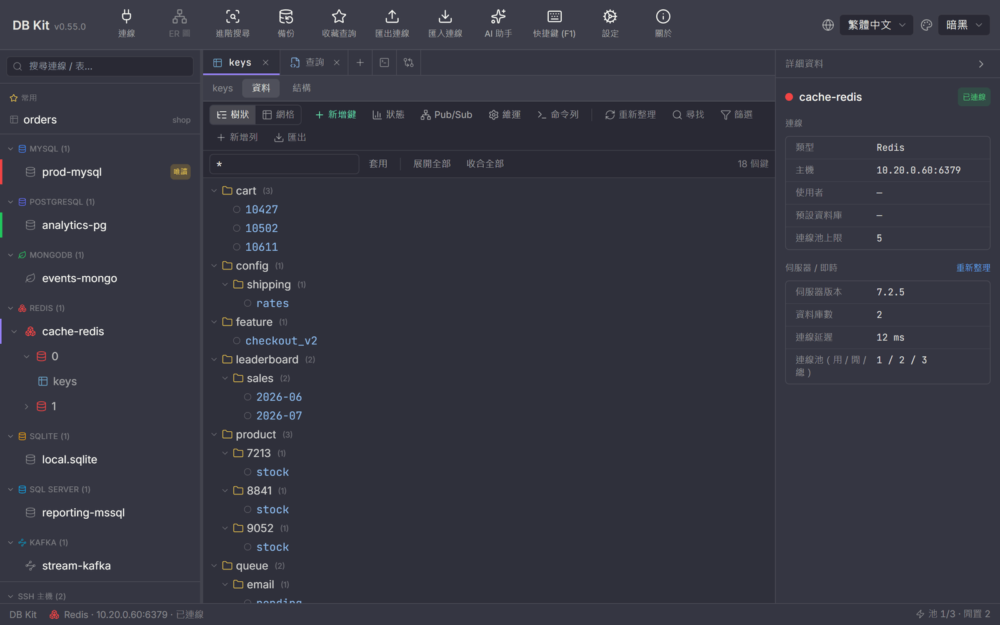 |
| **Schema compare & sync script** | **Review & Run (per-statement rollback)** |
|  | 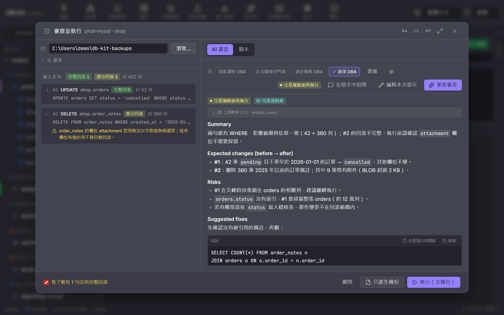 |
| **SSH terminal + SFTP** | **Remote desktop** |
| 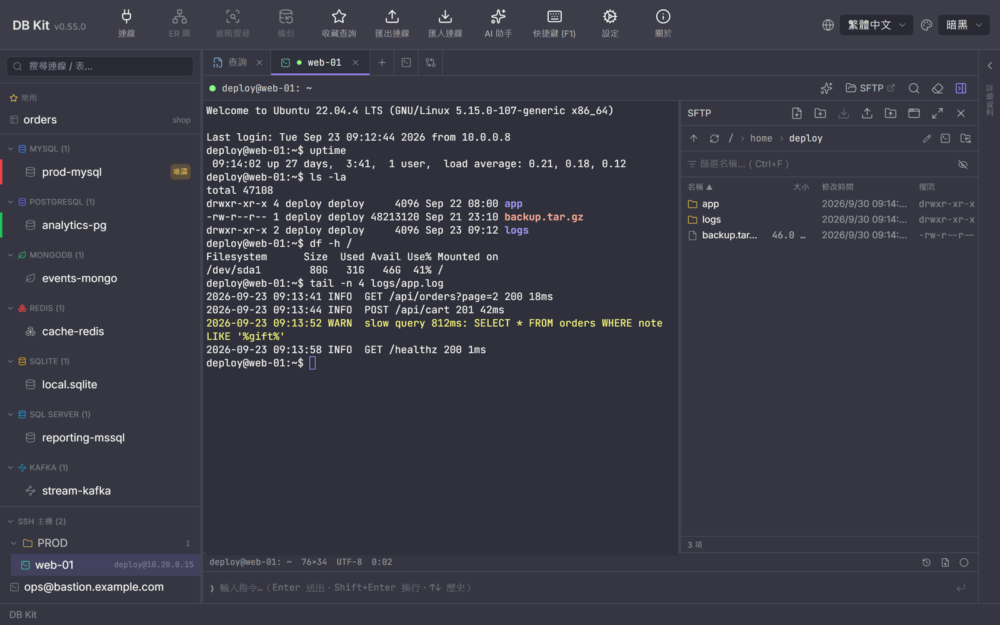 | 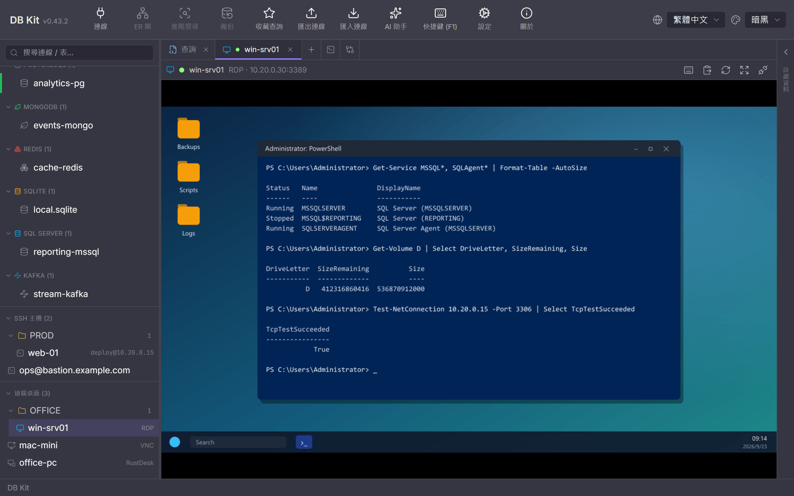 |
| **Docker** | **Kubernetes** |
| 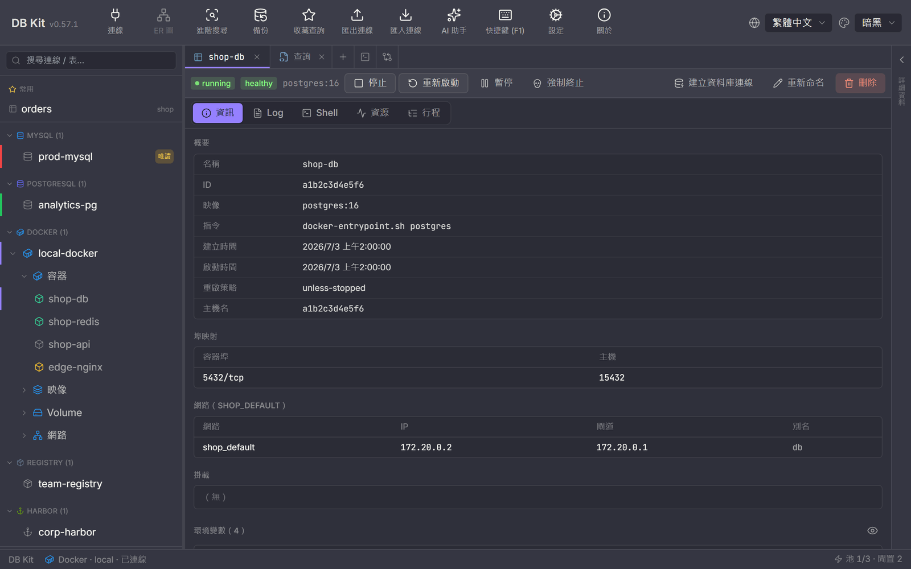 | 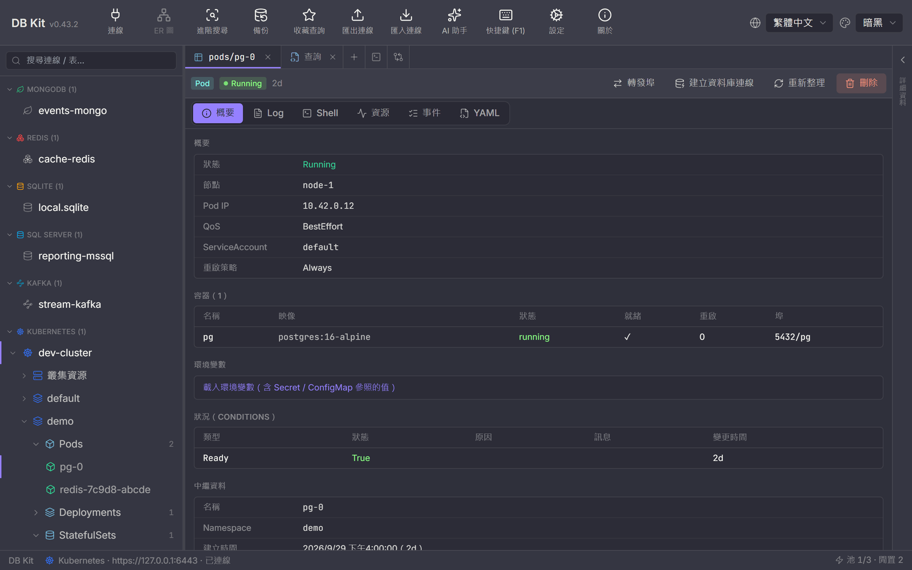 |

> More screenshots (Kafka, SQL stress test, SQL review, folder compare…) are in [`docs/screenshots/`](./docs/screenshots/). All data shown is fictional demo data.

## Features at a glance

| Area | What you get |
|------|--------------|
| Databases | MySQL / MariaDB / PostgreSQL / SQL Server / Oracle / SQLite / MongoDB / Redis: editable data grid, multi-column filter and sort, DDL and indexes, visual EXPLAIN, ER diagrams, stored procedures, import/export (CSV / Excel / JSON / SQL), backups and schedules |
| Messaging & search | Kafka (message browser with live tail, consumer groups, Schema Registry, Connect, ACLs, monitoring and alerts), RabbitMQ, Elasticsearch / OpenSearch |
| Query workspace | Autocomplete (including cross-database), stacked result sets, visual query builder, snippets, `:name` parameters, history and favorites, advanced object search (`Ctrl+Shift+G`), command palette (`Ctrl+K`) |
| Schema & data | Schema compare and sync (across databases, connections or snapshots), data transfer, row-level data compare, database documentation |
| Safety nets | **Review & Run** (AI review → per-statement before-image → rollback script → execute → diff report), static SQL review, DBA persona review, row limits and query timeouts, app lock |
| Testing & performance | SQL stress test (TPS, p50–p99), stored procedure integration tests (auto rollback, golden baselines, cross-engine diff, JUnit) |
| AI tool integration | **MCP server** (`dbk mcp`): one-click config for Claude Code / Codex / Cursor / VS Code / Claude Desktop / Windsurf; single or multiple connections, read-only by default, optional writes that are previewed and approved (with rollback scripts); stdio or local HTTP |
| AI | Chat assistant (`@` scopes, `/` commands), in-editor AI actions (explain / optimize / fix / convert dialect, previewed as a diff), AI library (personas, skills and prompts are Markdown files) |
| Remote & containers | SSH terminal + SFTP / FTP (resumable transfers, jump hosts, activity log), Docker / Registry / Harbor, Kubernetes (port-forward to in-cluster databases), remote desktop over RDP / VNC / RustDesk |
| File compare | Text / folder / binary compare and sync between local paths and SSH / FTP hosts |
| Interface | 7 themes, separate UI and code font sizes, six languages (繁中 / 简中 / English / 日本語 / 한국어 / Tiếng Việt), in-app updates |

See the [CHANGELOG](./CHANGELOG.md) for everything else.

## Download & install

<p align="center">
  <a href="https://github.com/markku636/db-kit/releases/latest">
    
  </a>
</p>

| Platform | Installer |
|----------|-----------|
| Windows 10 / 11 | `db-kit_x.y.z_x64-setup.exe` or `.msi` |
| macOS Apple Silicon / Intel | `db-kit_x.y.z_aarch64.dmg` / `db-kit_x.y.z_x64.dmg` |
| Linux | `.deb`, `.rpm` or the portable `.AppImage` |

The installers are not paid-signed, so the OS blocks the first launch:

- **Windows**: in SmartScreen, click "More info" → "Run anyway". Requires WebView2 Runtime (built into Windows 11).
- **macOS**: after dragging the app into Applications, run the line below once (run it again if a later update gets blocked):
  ```bash
  xattr -dr com.apple.quarantine "/Applications/DB Kit.app"
  ```
  Without the terminal: open the app once so it gets blocked → System Settings → Privacy & Security → "Open Anyway".
- **Linux**: `sudo dpkg -i db-kit_*.deb`, `sudo rpm -i db-kit-*.rpm`, or `chmod +x *.AppImage` and run it.

> **Oracle** needs the 64-bit [Oracle Instant Client](https://www.oracle.com/database/technologies/instant-client/downloads.html) on your PATH (server 12c or later); no other database needs anything extra.

## Quick start

1. Click **Connect** in the toolbar and pick a type. If you have a connection string (`postgres://`, `mongodb+srv://`, `ssh://`, JDBC, ADO.NET…), paste it and the fields fill themselves.
2. Enter host and credentials, set an SSH tunnel if needed, click **Test Connection**, then save.
3. Expand the database in the left tree and double-click a table to browse and edit.

| Common action | Shortcut |
|---------------|----------|
| Run statement at cursor / whole script | `Ctrl+Enter` / `F6` |
| Command palette / advanced object search | `Ctrl+K` / `Ctrl+Shift+G` |
| Toggle AI assistant / in-editor AI actions | `Ctrl+L` / `Ctrl+Shift+E` |

No database to try it on? Start one with Docker:

```bash
docker run --name mysql-test -e MYSQL_ROOT_PASSWORD=test1234 -p 3306:3306 -d mysql:8
```

## Guides

- [Schema compare](./docs/compare.en.md) · [Review & Run](./docs/review-run.en.md) · [DBA review](./docs/dba-review.en.md) · [AI library](./docs/ai-library.en.md) · [Stored procedure tests](./docs/sp-test.en.md) · [MCP server](./docs/mcp.en.md)
- [`dbk` CLI](./docs/cli.en.md) · [Architecture](./docs/architecture.en.md) · [Connection lifecycle](./docs/connection-lifecycle.en.md) · [Roadmap](./docs/roadmap.en.md)

## Command-line tool `dbk`

Reuses the connections and keychain entries saved in the GUI, and can be built as a lean binary without the GUI for servers:

```bash
cargo build --release --no-default-features --bin dbk

dbk --conn prod-mysql --format csv query "select id, name from users limit 20"
dbk --conn prod-mysql export orders --to orders.xlsx --data-format xlsx
dbk --conn prod-mysql exec "update users set status='active' where id=42" --yes
```

`query` only accepts read-only statements. Writes need `--yes`, and destructive ones (DROP / TRUNCATE / no WHERE) also need `--force`; without the flags it only shows what it would do. See [docs/cli.en.md](./docs/cli.en.md) for every subcommand.

## Build from source

Requires [Rust](https://rustup.rs/) (stable), [Node.js](https://nodejs.org/) 18+ and the [Tauri system dependencies](https://tauri.app/start/prerequisites/).

```bash
npm install
npm run tauri dev     # dev mode
npm run tauri build   # installer for the current platform → src-tauri/target/release/bundle/
```

On Windows you can also run `powershell -ExecutionPolicy Bypass -File .\build-installer.ps1`, which installs Rust and Node.js if missing. Pushing a `v*` tag makes [GitHub Actions](./.github/workflows/release.yml) build installers for all three platforms and create a Release.

## Support open source

If db-kit saved you time, you can buy me a coffee:

[](https://www.paypal.com/ncp/payment/8B7GRXA6UJH36)
[](https://www.paypal.com/ncp/payment/8LBTFUBBF2CHS)
[](https://www.paypal.com/ncp/payment/A653DD46GEU4W)
[](https://www.paypal.com/ncp/payment/Y5WPSXVGH3YS4)

For other amounts, use [PayPal.Me](https://paypal.me/226network).

## Author & license

Built by [Mark.K](https://github.com/markku636); dev notes at [blog.markkulab.net](https://blog.markkulab.net/). Released under the [MIT](./LICENSE) license; the RustDesk connector in `rustdesk-bridge/` is a separate AGPL program.
