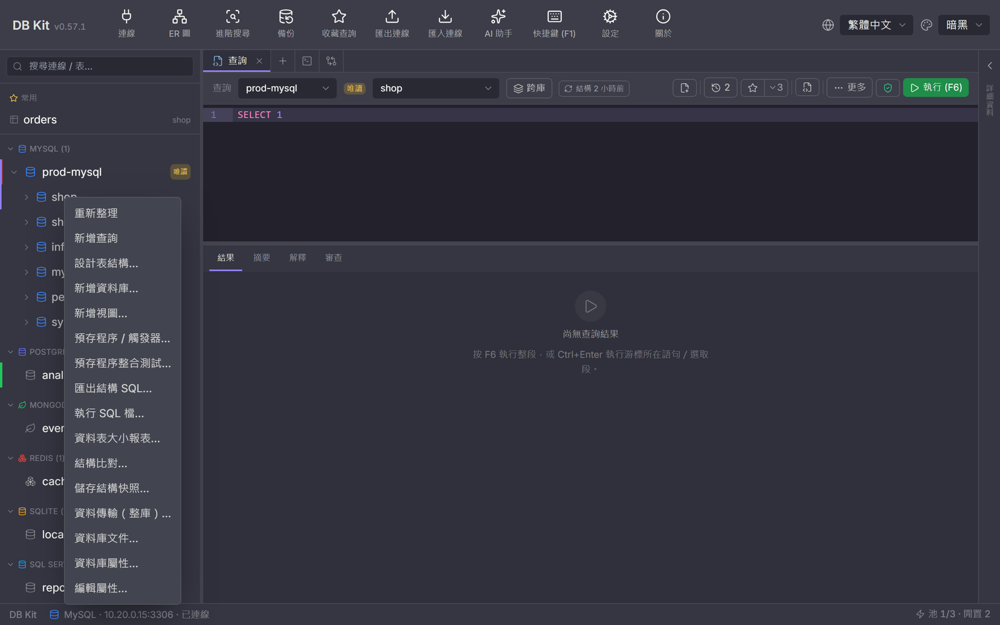
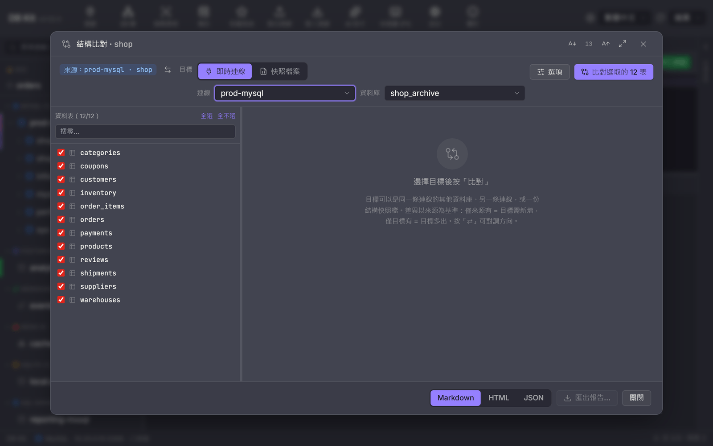
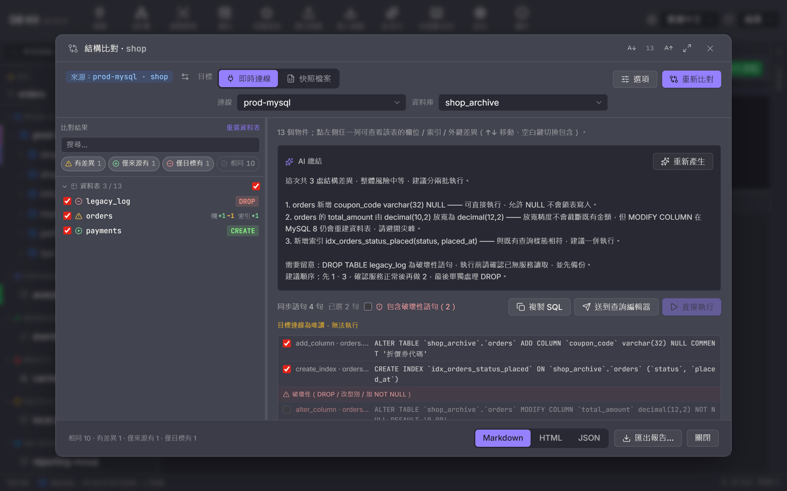
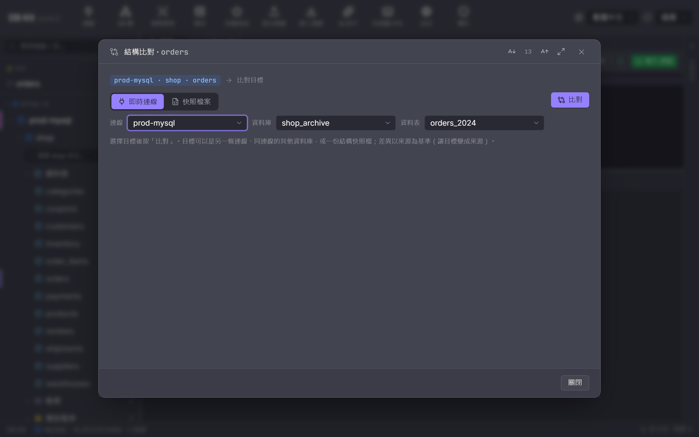
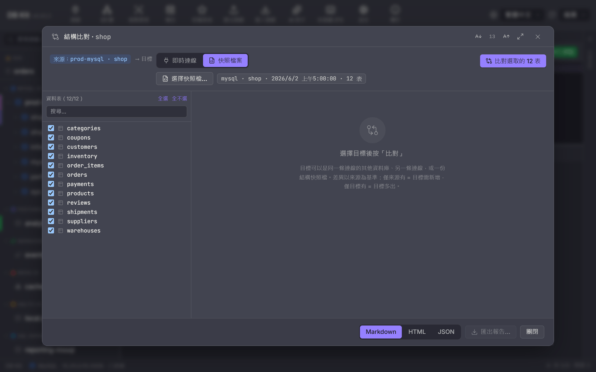
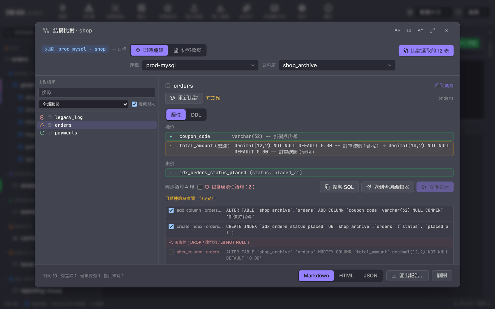
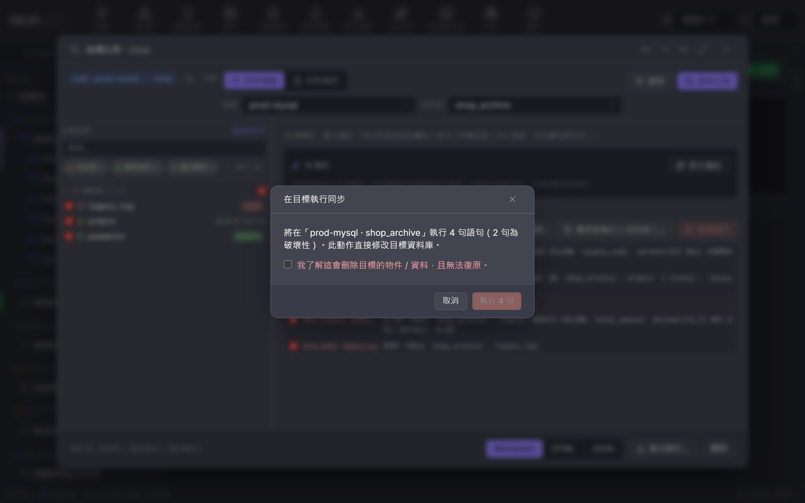

# Schema Compare Guide

[繁體中文](./compare.md) · **English**

Schema compare puts the **schema** of two databases side by side (tables, columns, indexes, foreign keys, views, stored procedures), finds the differences, and generates a sync SQL script that "makes the target match the source".

Typical uses:

- Before a release, confirm that the **staging** and **production** schemas have not drifted apart.
- After a release, compare against the **snapshot saved before the release** to confirm that only the intended things changed.
- When taking over an environment, compare it with a known-good environment to see exactly where they differ.

> This feature compares **schema** only, not the contents of rows. To compare rows (and generate INSERT / UPDATE / DELETE) for a single table, right-click it and choose "**Data compare…**": it compares the two tables by primary key, lists sample inserts / updates / deletes and generates sync SQL. It **only generates, never applies**; click "Send to target's query editor" to run it. For whole databases or scheduled runs, use `dbk compare data` on the command line; see the [CLI guide](./cli.en.md#compare--schema--schema--data-compare-and-snapshots).

Supports MySQL, MariaDB, PostgreSQL, SQL Server, Oracle, and SQLite.

---

## Remember one thing first: direction

**All differences are relative to the "source".** The "source" is the database / table you right-clicked; the "target" is the one you pick in the dialog.

| On screen | Meaning |
|---|---|
| Source only | Exists in the source, missing in the target → syncing will create it in the **target** |
| Target only | Exists in the target, missing in the source → syncing will drop it from the **target** |
| Different | Exists on both sides, but the definitions differ → syncing will change the **target** to match the source |
| Identical | Nothing to do |

The generated sync SQL is **always meant to run against the target**. Get the direction wrong and you will break the side that was correct, so before you click "Run now", check that the line at the very top of the dialog, "Source: …　→ Target …", says what you intend.

---

## Scenario 1: Compare two databases

**Step 1.** In the connection tree on the left, right-click the **source database** → "**Schema compare…**". The "Save schema snapshot…" item in the same menu is used later in Scenario 4.

<p align="center">
  
</p>

**Step 2.** Pick the target at the top of the dialog. The default is "**Live connection**":
   - **Connection** — you can choose the same connection or **a different connection** (only connections of the same type that are already connected are listed).
   - **Database** — the target database. For PostgreSQL this shows the **schema**.
   - System databases (`information_schema`, `master`, etc.) are filtered out and never appear in the list.
   - The "**⇄**" next to the source label swaps source and target, so you don't have to close and reopen the dialog if you picked the wrong direction.
   - "**Options**" adjusts the comparison rules (ignore name case / comments / default values, match indexes and foreign keys by definition) and scope (views, procedures). Your choices are remembered; the number on the button is "how many options differ from the defaults". Changed options only take effect after you click "Compare again", and the screen reminds you of this.
**Step 3.** The left pane lists every table in the source, **all checked** by default. To compare only a few, click "Select none" first and then pick them, or filter with the search box at the top.

<p align="center">
  
</p>

**Step 4.** Click "**Compare N selected tables**" at the top right and wait for the progress to finish (it shows something like "Fetching schema… 3/12"). With many tables you can click "Cancel" to abort.

When the comparison finishes, the left pane switches from "which tables to compare" to "what was found", and the right side shows the summary, the AI summary, and the sync script. To change which tables are compared, click "Reselect tables" in the left pane's header.

<p align="center">
  
</p>

> Views and stored procedures are **not affected by the table checkboxes**; they are always compared. The checkboxes only govern tables.

---

## Scenario 2: Compare a single table

Right-click a **table** → "**Schema compare…**".

There are only two differences from the whole-database mode:

- The target has an extra "**Table**" dropdown, so you can compare `orders` against `orders_new` in another database; the table names don't have to match.
- After choosing the target you must click "**Compare**" to run it; changing a dropdown does not wipe out results you already have.

The "⇄" button for swapping source and target is there too.

<p align="center">
  
</p>

Use this when "I only changed this table and only want to check this table"; it is much faster than comparing the whole database.

---

## Scenario 3: Cross-connection compare (production vs. staging on different hosts)

This is the most common scenario and the one that needs the most care. The steps are exactly the same as Scenario 1, except that you pick **a different connection** in the "Connection" dropdown.

Once you do, an extra reminder line appears:

> Cross-connection compare: source staging, target prod (sync SQL will be sent to the target connection)

If you see this line, you are working across hosts. **Sync SQL is sent to the target connection**, not the source.

Both connections must be **connected first** (expanded in the connection tree at least once), otherwise they won't appear in the dropdown. Both sides must also be of the same type: MySQL can only be compared with MySQL or MariaDB, not with PostgreSQL.

> To avoid slips, put the production connection in **read-only mode** (right-click the connection → "Set as read-only mode"). From then on, whenever it is the target, "Run now" is greyed out and shows "Target connection is read-only; cannot run".

---

## Scenario 4: Use a snapshot as the baseline

When what you want to compare against is not "another database" but "what this database looked like **last week**", use a snapshot.

**Save a snapshot first** (before the release):

1. Right-click the database → "**Save schema snapshot…**".
2. Choose where to save it. The default file name includes the database name and the time, e.g. `shop-schema-20260915-0905.json`.

The file is plain JSON, so you can put it under Git version control alongside your code.

**Compare against it later**:

1. Right-click the database → "Schema compare…".
2. In the target row, switch from "Live connection" to "**Snapshot file**", click "Choose snapshot file…" and pick the `.json`.
3. The snapshot's kind, database name, capture time, and table count are shown next to it; confirm it is the one you want.
4. Compare as usual.

<p align="center">
  
</p>

When a snapshot is the target, "Run now" is unavailable (a file cannot execute SQL) and shows "Target is a snapshot file; cannot run". You can still copy the SQL or export a report.

> Snapshot loading is strict: a corrupt file fails with an error and is **not** treated as an "empty database". This is deliberate: using an empty snapshot as the target would produce "drop every table".

---

## Reading the results

The left pane is grouped into **Tables / Views / Procedures** (the headers are collapsible; the numbers are "currently shown / total"). Each row reads, from left to right: **checkbox** (whether it goes into the sync script), **status icon**, name, and **diff summary**.

| Icon | Status | Description |
|---|---|---|
| Green check | Identical | Schemas match |
| Yellow exclamation mark | Different | Exists on both sides but the definitions differ |
| Green plus | Source only | The target is missing this object |
| Red minus | Target only | The target has this extra object |

You can see the diff summary without drilling in: a table with differences reads like "col +1 ~1 · idx +1" (separate counts for added / changed / removed), source-only objects are marked `CREATE`, target-only objects are marked `DROP` (the action syncing will generate), and objects whose only difference is the text of the CREATE TABLE DDL are marked `DDL`.

The four **status chips** at the top (Different / Source only / Target only / Identical) each carry a count; click one to toggle its visibility, and you can select several. By default **identical objects are hidden**, and your choice is remembered. The search box filters by name.

**The checkboxes drive the sync script**: uncheck a table and its statements are dimmed together in the script panel on the right and marked "Excluded", so you don't have to hunt them down one by one. The checkbox in a group header includes / excludes the whole group (tri-state). Identical objects have no checkbox, since there is nothing to sync.

**Click any row** to expand its details:

- **Tables** — differences in columns, indexes, and foreign keys are listed item by item (changed rows read "source → target", with the parts that actually differ highlighted), along with the CREATE TABLE DDL from both sides in a side-by-side diff.
- **Views / Procedures** — the definition text from both sides, side by side.

The side-by-side DDL view has line numbers on both sides, word-level highlighting (`varchar(50)` → `varchar(200)` highlights only `50` and `200`), "**Differences only**" to fold identical lines (keeping 3 lines of context around each difference; click "⋯ Expand N identical lines ⋯" to unfold), plus "Previous / Next difference" navigation with a counter.

<p align="center">
  
</p>

"**Previous / Next object**" at the right of the details header jumps straight between objects (following the current filter and group order), so you don't have to go back to the list each time; "Back to overview" returns to the overview. The list also supports the keyboard: **↑ ↓** to move, **Home / End** to jump to the first / last item, **Space** to toggle inclusion, and **←** or **Backspace** to go back to the overview. The divider between the left pane and the right side can be dragged, and its width is remembered.

---

## AI summary

The right side of the overview has an "**AI summary**" panel. Click "**Generate summary**" to hand the differences to your currently configured AI provider and have it organize them into **risks and a recommended execution order**, e.g. "these three statements can run as-is, but before the DROP TABLE make sure no service is still reading from it".

- Only a **summary of the schema differences** is sent; no row contents are sent.
- The text streams in, and you can click "Stop" partway through.
- For a different take, click "Regenerate".
- A generated summary is also written into exported reports.

If no AI provider is configured, this panel does nothing; every other feature is completely unaffected.

---

## Sync script

The lower half of the overview is "**Sync statements (N)**". This is the output of the whole feature.

**Statements are ordered** by dependency: drop foreign keys first → create missing tables → drop indexes → alter columns → create indexes → add foreign keys → views → procedures → DROP TABLE last. Run them in order and you won't get stuck on "something still depends on it".

**Every statement has a checkbox**; uncheck the ones you don't want to apply without affecting the others. The header shows "M selected". Statements belonging to objects unchecked in the left pane are greyed out here and marked "Excluded", and re-checking restores them. To skip a whole table use the left pane; to skip a single statement use this list.

**Destructive statements are grouped separately** under the heading "Destructive (DROP / type change / add NOT NULL)". The following go into this group:

- `DROP TABLE` / `DROP COLUMN` / `DROP VIEW` / `DROP` procedure
- Changing a column's type (may truncate data)
- Changing a nullable column to `NOT NULL` (existing NULLs will make the statement fail)
- Dropping a unique index

To send them, you must first check "**Include destructive statements (N)**" at the top.

### Three ways out

| Button | What it does | When to use it |
|---|---|---|
| **Copy SQL** | Copies to the clipboard | To paste into a ticket, hand to someone for review, or run in another tool |
| **Send to query editor** | Opens a query tab on the **target connection** and pastes it there | When you want to edit a few statements first, run in batches, or look at the execution plan |
| **Run now** | Runs each statement against the target, one by one | When you are sure it is correct and want to do it all at once |

"Run now" first shows a confirmation dialog that spells out "Run 4 statements on 'prod-mysql · shop_archive' (2 destructive)". **Whenever the selected statements include destructive ones, you must also check "I understand this will delete objects / data in the target and cannot be undone."** before you can proceed; until it is checked, the run button cannot be clicked.

<p align="center">
  
</p>

Execution is **statement by statement**, not one big transaction. If a statement in the middle fails, the ones that already succeeded are not rolled back; when it finishes, each statement is marked as succeeded or failed with its error message, and a line such as "Run finished: 6 succeeded, 2 failed" is shown. This is deliberate: schema changes mostly cannot live in a single transaction (DDL implicitly commits on many databases), so pretending a rollback is possible would be more dangerous.

When the run finishes, it **re-compares automatically**, so the list and the script reflect the post-apply state; the old results stay on screen until the new ones arrive.

### The "cannot generate statements automatically" list

Some changes cannot be expressed by the engine; they are listed at the very bottom under "**The following changes cannot be generated automatically; please handle them manually:**". Common ones:

- **SQLite** changing a column type or foreign key: the whole table has to be rebuilt.
- **SQL Server** changing a named default constraint, changing IDENTITY, and changing the type of a column covered by a **primary key / unique index**.
- **PostgreSQL** functions and `serial` columns when syncing across schemas (their definitions hard-code the source schema; copying them verbatim would make both sides share the same sequence).
- Primary key changes.
- Differences only in the character set / storage engine / table comment of the CREATE TABLE statement.

**This section is not a warning; it is a to-do list.** Anything listed here means those differences will **still be there** after the sync script runs, and you have to handle them yourself.

---

## Exporting a report

At the bottom of the dialog choose **Markdown / HTML / JSON**, then click "Export report…" to save.

| Format | Contents | Good for |
|---|---|---|
| Markdown | Summary table + object list + per-table itemized differences + full script | Pasting into a PR, ticket, or Confluence |
| HTML | Same as above, opens directly in a browser | Sending to people who don't read Markdown |
| JSON | Full structured diff | Processing with scripts, archiving for later comparison |

All three include the AI summary (if you generated one) and the "cannot generate statements automatically" list.

---

## Database-specific notes

- **PostgreSQL** — the "Database" dropdown here means **schema**. When syncing views across schemas, table names inside the view body still point to the source schema; the statement comes with a reminder, and you must edit it yourself before applying.
- **SQL Server** — objects outside `dbo` are shown as `sales.orders`. Sync statements for views and procedures are wrapped in `EXEC [target_db].sys.sp_executesql N'…'`, because T-SQL does not accept a database prefix on statements such as `CREATE VIEW`. When changing a column **covered by an index**, the script automatically drops the index first and recreates it after the change.
- **MySQL / MariaDB** — treated as the same family and can be compared with each other.
- **SQLite** — one file is one database, so there is no "Database" dropdown.
- **Oracle** — identifiers are case-sensitive and are always double-quoted. Auto-named constraints (`SYS_C…`) are matched by content, not by name.
- **Across database types** (e.g. MySQL vs. PostgreSQL) — you can view the differences, but **no sync DDL is generated**, and types are only compared roughly by "family" (`int` vs. `integer` counts as identical). The screen says so.

---

## Using it in CI or on a schedule

The same engine is available on the command line, which is handy for "turn the build red when the schema drifts":

```bash
# Exit with a non-zero code if there are differences
dbk --conn staging -d shop compare schema --dst prod --exit-code

# Save a baseline snapshot into version control
dbk --conn prod -d shop schema snapshot --to baseline/shop.json

# Compare production against the baseline in the codebase
dbk --conn prod -d shop compare schema --dst baseline/shop.json --exit-code

# Generate sync DDL (without DROP) for someone to review
dbk --conn staging -d shop compare schema --dst prod --sync
```

For the full set of flags, see the [compare section of the CLI guide](./cli.en.md#compare--schema--schema--data-compare-and-snapshots).

---

## FAQ

**The connection I want isn't in the target dropdown.**
That connection isn't connected yet, or it is a different type. Expand it in the connection tree first, then reopen the dialog.

**The "Compare" button is greyed out.**
Source and target point to the same database (or the same table); a message in red on screen explains this. Pick a different target. In whole-database mode you also need at least one table checked.

**Lots of objects show as "Different", but drilling in I can't see what differs.**
Usually the character set, storage engine, or table comment of the CREATE TABLE statement differs while the columns themselves are the same. The diff summary for such rows is marked `DDL`; switch to the DDL view and click "Differences only" to see that line. It also appears in the "cannot generate statements automatically" list. If only the comments differ, check "Ignore comments" under "Options" and compare again for a clean result.

**I compared again after syncing and there are still differences.**
Look at the "cannot generate statements automatically" section first; the remaining differences are usually exactly the items it lists. If not, and some statements failed during the run, go back and read the error messages for those failed statements.

**"Run now" is greyed out.**
The target is a snapshot file, or the target connection is set to read-only. The reason is shown next to the button.

**I picked the wrong direction and swapped source and target.**
Sync SQL is only ever sent to the **target**. If you haven't clicked "Run now" yet, nothing has happened; click the "⇄" next to the source label to swap them and compare again. If you already ran it, swap the two sides and compare again, and the generated script will be the reverse fix. However, destructive statements (things that have already been DROPped) cannot be recovered, which is exactly why that step requires the extra checkbox.
