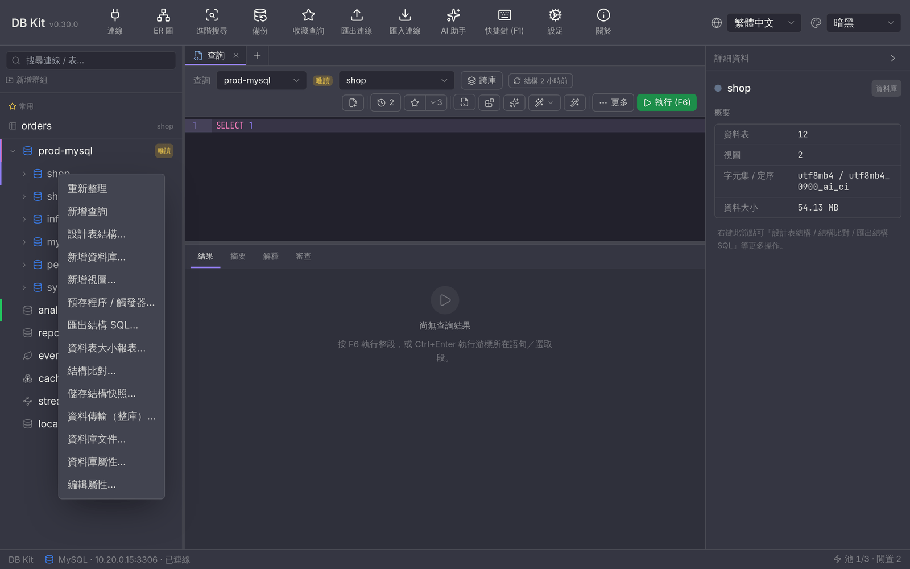
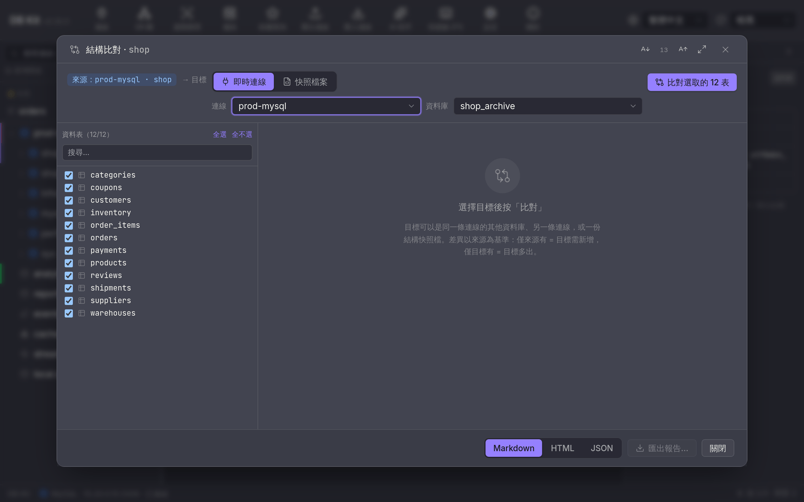
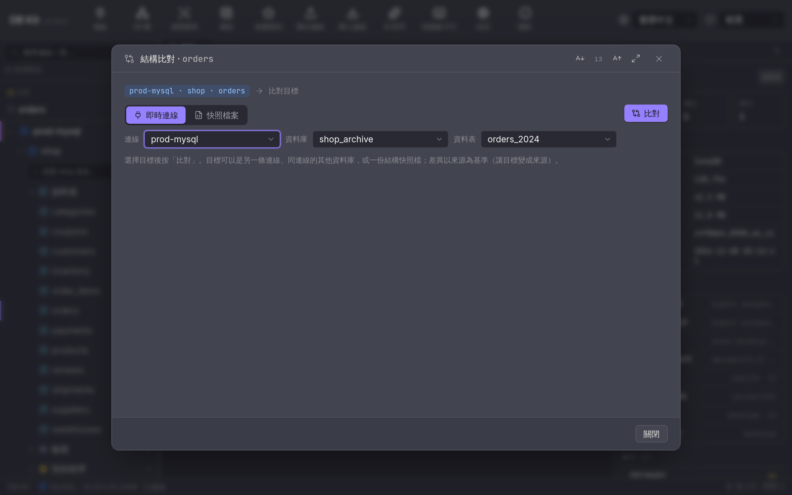
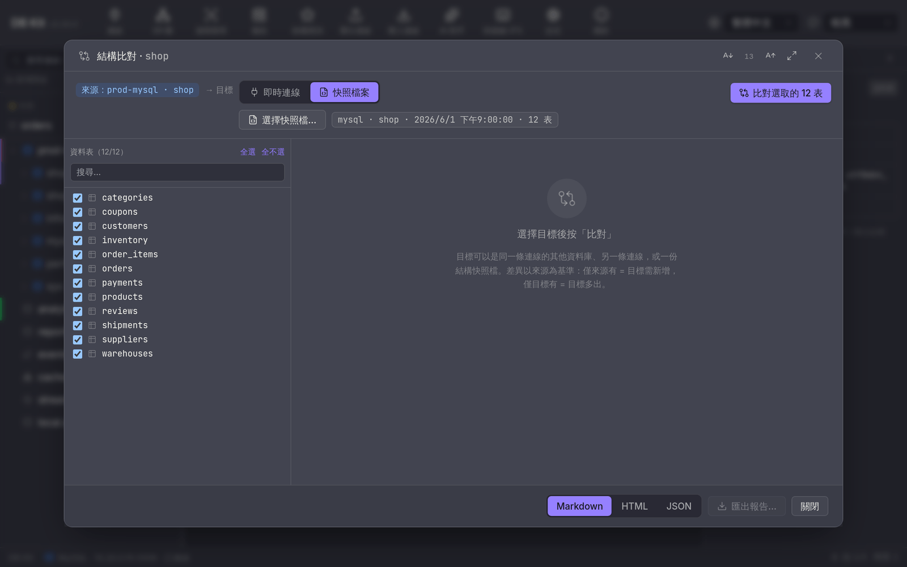
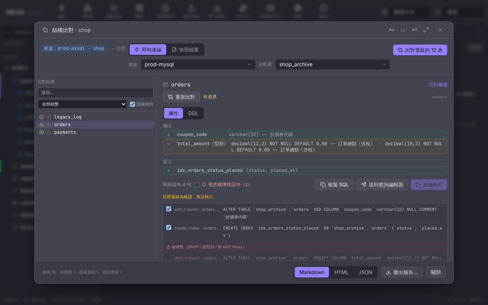
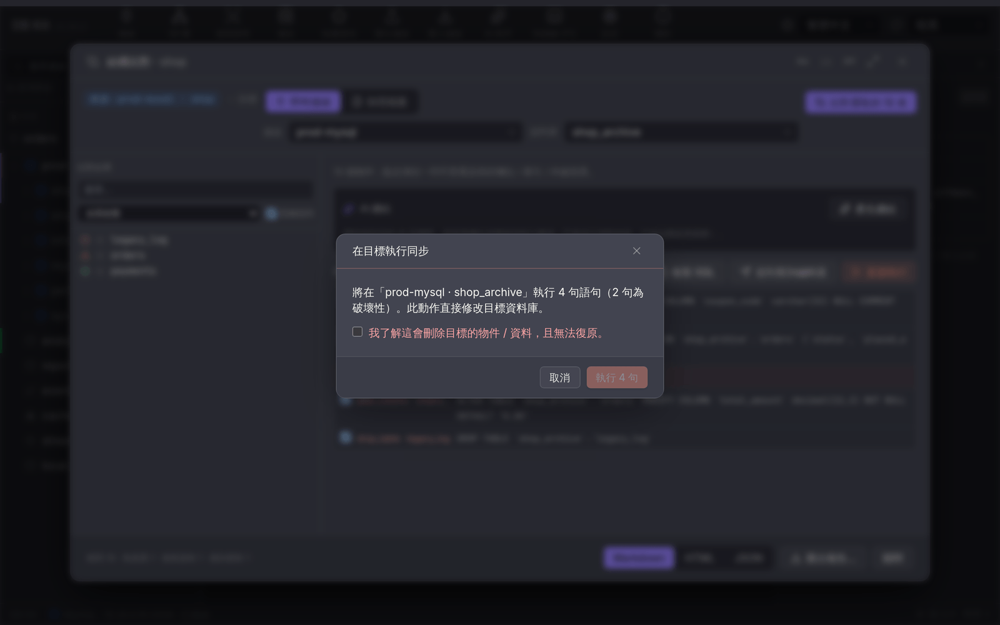

# 結構比對使用指南

把兩個資料庫的**結構**（資料表、欄位、索引、外鍵、視圖、預存程序）拿來對照，找出差異，並產生一份「讓目標變得跟來源一樣」的同步 SQL。

典型用途：

- 上線前確認**測試環境**與**正式環境**的結構沒有走鐘。
- 某次改版後，回頭比對**改版前存下的快照**，確認只動了該動的東西。
- 接手一個環境時，拿它跟已知正確的環境比，先看清楚差在哪。

> 這個功能只比**結構**，不比資料列的內容。要比資料列（產生 INSERT / UPDATE / DELETE）請用命令列的 `dbk compare data`，見 [CLI 指南](./cli.md#compare--schema--結構--資料比對與快照)。

支援 MySQL、MariaDB、PostgreSQL、SQL Server、Oracle、SQLite。

---

## 先記住一件事：方向

**所有差異都以「來源」為基準。**「來源」是你按右鍵的那個資料庫 / 資料表，「目標」是你在對話框裡挑的那一個。

| 畫面上寫 | 意思 |
|---|---|
| 僅來源有 | 來源有、目標沒有 → 同步時會在**目標**建立它 |
| 僅目標有 | 目標有、來源沒有 → 同步時會從**目標**刪掉它 |
| 有差異 | 兩邊都有，但定義不同 → 同步時會把**目標**改成來源的樣子 |
| 相同 | 沒事 |

產生的同步 SQL **一律是要在目標上執行的**。搞錯方向就會把正確的那一邊改壞，所以按下「直接執行」之前，先確認對話框最上面那條「來源：…　→ 目標　…」寫的是你想要的。

---

## 情境一：比對兩個資料庫

**第 1 步.** 在左側連線樹上，對著**來源資料庫**按右鍵 →「**結構比對…**」。同一份選單裡的「儲存結構快照…」等一下情境四會用到。

<p align="center">
  
</p>

**第 2 步.** 對話框上方挑目標。預設是「**即時連線**」：
   - **連線** — 可以選同一條連線，也可以選**另一條連線**（只列出同類型且已連上的）。
   - **資料庫** — 目標資料庫。PostgreSQL 這裡顯示的是 **schema**。
   - 系統資料庫（`information_schema`、`master` 等）已經濾掉，不會出現在清單裡。
**第 3 步.** 左欄會列出來源的所有資料表，預設**全部勾選**。只想比其中幾張就先用「全不選」再挑，或用上方的搜尋框過濾。

<p align="center">
  
</p>

**第 4 步.** 按右上角「**比對選取的 N 表**」，等進度跑完（會顯示「擷取結構中… 3/12」之類的字樣）。表很多時可以按「取消」中止。

比對結束後，左欄從「要比哪些表」換成「比出什麼」，右側是摘要、AI 總結與同步腳本。

<p align="center">
  
</p>

> 視圖與預存程序**不受資料表勾選影響**，一律會比。勾選框只管資料表。

---

## 情境二：只比一張資料表

對著**資料表**按右鍵 →「**結構比對…**」。

跟整庫的差別只有兩個：

- 目標多一個「**資料表**」下拉，所以你可以拿 `orders` 去比另一個庫的 `orders_new`，表名不必相同。
- 選完目標要按「**比對**」才會跑，切換下拉不會把已經跑出來的結果洗掉。

<p align="center">
  
</p>

適合「我只改了這張表，只想確認這張表」的時候，比整庫快很多。

---

## 情境三：跨連線比對（正式 vs 測試在不同主機）

這是最常見也最需要小心的情境。做法跟情境一完全一樣，只是在「連線」下拉挑**另一條連線**。

挑了之後，畫面上會多一行提醒：

> 跨連線比對：來源 staging，目標 prod（同步 SQL 會送到目標連線）

看到這行就表示你正在跨主機操作。**同步 SQL 會送到目標那條連線**，不是來源。

要比的兩條連線都必須**先連上**（在連線樹上點開過），否則不會出現在下拉裡。兩邊也必須是同一類型：MySQL 只能比 MySQL 或 MariaDB，不能比 PostgreSQL。

> 想避免手滑，把正式環境的連線設成**唯讀模式**（連線上按右鍵 →「設為唯讀模式」）。之後只要它是目標，「直接執行」就會變灰，並顯示「目標連線為唯讀，無法執行」。

---

## 情境四：拿快照當基準

想比的不是「另一個資料庫」，而是「這個資料庫**上週**的樣子」時，用快照。

**先存快照**（改版前）：

1. 對資料庫按右鍵 →「**儲存結構快照…**」。
2. 選存檔位置。檔名預設會帶上資料庫名與時間，例如 `shop-schema-20260915-0905.json`。

檔案是純 JSON，可以放進 Git 版控，跟著程式碼一起走。

**之後拿它來比**：

1. 對資料庫按右鍵 →「結構比對…」。
2. 目標那排從「即時連線」切到「**快照檔案**」，按「選擇快照檔…」挑那個 `.json`。
3. 旁邊會顯示快照的種類、資料庫名、擷取時間與表數，確認是你要的那一份。
4. 照常比對。

<p align="center">
  
</p>

快照當目標時，「直接執行」不能用（檔案沒辦法執行 SQL），會顯示「目標為快照檔，無法執行」。你還是可以複製 SQL 或匯出報告。

> 快照載入是嚴格的：檔案壞掉會直接報錯，**不會**當成「空的資料庫」。這是刻意的——把空快照當目標，產出的會是「刪掉所有資料表」。

---

## 看懂比對結果

左欄每一列前面有兩個圖示：**狀態**和**物件種類**（資料表 / 視圖 / 程序）。

| 圖示 | 狀態 | 說明 |
|---|---|---|
| 綠色勾 | 相同 | 結構一致 |
| 黃色驚嘆號 | 有差異 | 兩邊都有但定義不同 |
| 綠色加號 | 僅來源有 | 目標缺這個物件 |
| 紅色減號 | 僅目標有 | 目標多出這個物件 |

預設會**隱藏相同的物件**（右上角「隱藏相同」可取消）。也可以用下拉只看某一種狀態，或用搜尋框找特定名稱。

**點任何一列**可以展開細節：

- **資料表** — 欄位、索引、外鍵逐項列出差異，並附上兩邊的建表 DDL 並排比對。
- **視圖 / 程序** — 兩邊的定義文字並排，逐行標出增刪。

<p align="center">
  
</p>

點「回到彙總」回到總覽。

---

## AI 總結

總覽右側有「**AI 總結**」一格，按「**產生總結**」會把差異交給你目前設定的 AI 供應商，請它整理成**風險與建議的執行順序**，例如「這三句可以直接跑，但 DROP TABLE 那句要先確認沒有服務在讀」。

- 只送**結構差異的摘要**，不送任何資料列的內容。
- 文字是串流出現的，中途可以按「停止」。
- 想換個講法就按「重新產生」。
- 產生過的總結會一起寫進匯出的報告裡。

沒設定 AI 供應商的話這一格不會有作用，其餘功能完全不受影響。

---

## 同步腳本

總覽下半部是「**同步語句 N 句**」。這是整個功能的產出。

**語句是排好序的**，照相依性：先拆外鍵 → 建缺少的表 → 卸索引 → 改欄位 → 建索引 → 加外鍵 → 視圖 → 程序 → 最後才 DROP TABLE。照順序執行就不會卡在「還有東西依賴它」。

**每一句前面都有勾選框**，不想套用的可以取消勾選，不影響其他句。

**破壞性語句另外分一組**，標題是「破壞性（DROP / 改型別 / 加 NOT NULL）」。會被歸進來的有：

- `DROP TABLE` / `DROP COLUMN` / `DROP VIEW` / `DROP` 程序
- 改變欄位型別（可能截斷資料）
- 把可空欄位改成 `NOT NULL`（既有的 NULL 會讓語句失敗）
- 卸掉唯一索引

要把它們送出去，得先勾上方的「**包含破壞性語句（N）**」。

### 三種出口

| 按鈕 | 做什麼 | 什麼時候用 |
|---|---|---|
| **複製 SQL** | 複製到剪貼簿 | 要貼進工單、給別人 review、或在別的工具執行 |
| **送到查詢編輯器** | 在**目標連線**開一個查詢分頁並貼上 | 想先自己改幾句、分段執行、或看執行計畫 |
| **直接執行** | 逐句在目標上執行 | 確定沒問題，要一次做完 |

「直接執行」會先跳一個確認框，寫明「將在『prod-mysql · shop_archive』執行 4 句語句（2 句為破壞性）」。**只要選取的語句裡有破壞性的，就必須再勾一次「我了解這會刪除目標的物件 / 資料，且無法復原。」** 才按得下去——沒勾之前，執行鈕是按不動的。

<p align="center">
  
</p>

執行是**逐句**的，不是一個大交易。中間某句失敗不會讓前面成功的回滾；跑完會逐句標出成功或失敗與錯誤訊息，並顯示「執行完成：6 句成功，2 句失敗」。這是刻意的——結構變更多半不能放在同一個交易裡（很多資料庫的 DDL 會隱含提交），假裝可以回滾反而危險。

### 「無法自動產生語句」清單

有些變更引擎表達不出來，會列在最下面的「**以下變更無法自動產生語句，請手動處理：**」。常見的有：

- **SQLite** 改欄位型別或外鍵 —— 得重建整張表。
- **SQL Server** 改具名的預設值約束、改 IDENTITY、以及被**主鍵 / 唯一索引**蓋住的欄位要改型別。
- **PostgreSQL** 跨 schema 同步時的函式與 `serial` 欄位（定義裡寫死了來源 schema，照抄會讓兩邊共用同一個序列）。
- 主鍵變更。
- 只有建表語句的字元集 / 儲存引擎 / 表註解不同。

**這一區不是警告，是待辦事項。** 東西列在這裡表示同步腳本跑完之後，那些差異**還在**，要你自己處理。

---

## 匯出報告

對話框底部可選 **Markdown / HTML / JSON**，按「匯出報告…」存檔。

| 格式 | 內容 | 適合 |
|---|---|---|
| Markdown | 摘要表 + 物件清單 + 每張表的逐項差異 + 完整腳本 | 貼進 PR、工單、Confluence |
| HTML | 同上，可直接用瀏覽器開 | 寄給不看 Markdown 的人 |
| JSON | 完整結構化差異 | 給腳本處理、存檔比對 |

三種都會包含 AI 總結（如果你產生過）和「無法自動產生語句」清單。

---

## 各資料庫的注意事項

- **PostgreSQL** — 這裡的「資料庫」下拉指的是 **schema**。跨 schema 同步視圖時，視圖本體裡的表名仍然指向來源 schema，語句會附一條提醒，套用前要自己改。
- **SQL Server** — 非 `dbo` 的物件會顯示成 `sales.orders`。視圖與程序的同步語句會包成 `EXEC [目標庫].sys.sp_executesql N'…'`，因為 T-SQL 不接受在 `CREATE VIEW` 之類的語句上加資料庫前綴。要改一個**被索引蓋住**的欄位時，腳本會自動先卸索引、改完再建回去。
- **MySQL / MariaDB** — 兩者視為同一家族，可以互比。
- **SQLite** — 一個檔案就是一個資料庫，沒有「資料庫」下拉可選。
- **Oracle** — 識別字大小寫敏感，一律加雙引號。自動命名的約束（`SYS_C…`）靠內容配對，不看名字。
- **跨資料庫種類**（例如 MySQL 比 PostgreSQL）—— 可以看差異，但**不會產生同步 DDL**，型別只會以「家族」粗略比對（`int` 對 `integer` 視為相同）。畫面上會標明。

---

## 放進 CI 或排程

同一套引擎在命令列也有，適合做成「結構跑掉就讓 build 紅燈」：

```bash
# 有差異就回非零結束碼
dbk --conn staging -d shop compare schema --dst prod --exit-code

# 存一份基準快照進版控
dbk --conn prod -d shop schema snapshot --to baseline/shop.json

# 拿程式碼裡的基準比線上
dbk --conn prod -d shop compare schema --dst baseline/shop.json --exit-code

# 產生同步 DDL（不含 DROP）交給人看
dbk --conn staging -d shop compare schema --dst prod --sync
```

完整旗標見 [CLI 指南的 compare 章節](./cli.md#compare--schema--結構--資料比對與快照)。

---

## 常見問題

**目標下拉裡找不到我要的連線。**
那條連線還沒連上，或種類不同。先在連線樹上點開它，再回來重開對話框。

**「比對」按鈕是灰的。**
來源和目標指到同一個資料庫（或同一張表）了，畫面上會有紅字說明。換一個目標。整庫模式下也要至少勾一張表。

**比出一堆「有差異」，但點進去看不出哪裡不同。**
多半是建表語句的字元集、儲存引擎或表註解不同，欄位本身其實一樣。這種會出現在「無法自動產生語句」清單裡。

**同步跑完再比一次，還是有差異。**
先看「無法自動產生語句」那一區，差異通常就是它列的那幾項。若不是，而且執行時有語句失敗，回頭看失敗那幾句的錯誤訊息。

**「直接執行」是灰的。**
目標是快照檔，或目標連線被設成唯讀。按鈕旁邊會寫原因。

**我按錯方向，把來源和目標弄反了。**
同步 SQL 只會送到**目標**。如果還沒按「直接執行」，什麼都沒發生，重開對話框換邊即可。已經執行了的話，把兩邊對調再比一次，產生的腳本就是反向的修正——但破壞性語句（已經 DROP 掉的東西）救不回來，這也是為什麼那一格要多勾一次。
