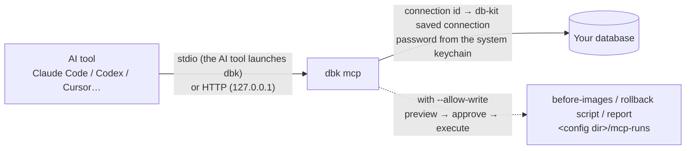

# MCP server: connect your databases to AI tools

[繁體中文](./mcp.md) · **English**

`dbk mcp` is a [Model Context Protocol](https://modelcontextprotocol.io) server. Once Claude Code, Codex, Cursor, VS Code (Copilot), Claude Desktop or Windsurf is connected to it, the AI can list tables, read columns, query data and look at execution plans on its own — using the connections you saved in db-kit, while passwords stay in the system keychain.

It is **read-only by default**. Letting the AI change data must be switched on explicitly when the server starts, and every change goes through Review & Run: the affected rows and rollback coverage are previewed first, it runs only after you approve in the AI tool, before-images are captured automatically and a rollback script is left behind.

- [At a glance](#at-a-glance)
- [Set up in the app (fastest)](#set-up-in-the-app-fastest)
- [Set up from the command line](#set-up-from-the-command-line)
- [Single connection vs. multiple connections](#single-connection-vs-multiple-connections)
- [Tools](#tools)
- [Letting the AI change data](#letting-the-ai-change-data)
- [HTTP mode](#http-mode)
- [Config file locations](#config-file-locations)
- [Security model](#security-model)
- [FAQ](#faq)

## At a glance



| You want to… | Do this |
|---|---|
| Let an AI tool query one database | Right-click the connection → "Connect to AI tools (MCP)…" → "Write config" |
| Let the AI pick among several databases | Settings → "Set up MCP…" → "Several connections" |
| Let the AI change data (each change needs your approval) | Tick "Allow the AI to change data" |
| Use it on a server / in CI | `dbk --conn shop mcp`, or `dbk mcp install --client claude-code --yes` |

## Set up in the app (fastest)

Both entry points open the same dialog:

- **Right-click a connection → "Connect to AI tools (MCP)…"**: that connection is preselected.
- **Settings → "MCP server" → "Set up MCP…"**: defaults to multiple connections.

<p align="center"></p>

Top to bottom, these are the decisions to make:

1. **Which connections**: one fixed connection (optionally with a default database / schema), or several and let the AI pick (nothing selected = all usable connections). Kafka / Elasticsearch / container connections are not supported by dbk and are skipped.
2. **Permissions**: read-only by default. With "Allow the AI to change data" ticked you can additionally allow destructive statements (DROP / TRUNCATE / UPDATE·DELETE without WHERE) and production connections. The dialog tells you how many connections are actually writable.
3. **AI tool and connection method**: pick the client; "Launched by the AI tool" (stdio, recommended) or "HTTP" (see [HTTP mode](#http-mode)). Clients with project-level configs can write into a project folder.
4. **Configuration**: the snippet and target file are previewed live. Copy and paste it yourself, or click "Write config" — the original file is backed up as `<file>.dbkit-bak`, only db-kit's own entry is changed, and everything else is kept as is.

<p align="center"></p>

Restart the AI tool afterwards. Entries already written are marked "Written", the button becomes "Update config", and "Remove from config" appears at the bottom left.

## Set up from the command line

`dbk mcp config` prints the snippet (writes nothing); `dbk mcp install` writes the config file:

```bash
# Print Cursor's config (multiple connections, read-only)
dbk mcp config --client cursor

# Add the "shop" connection to Claude Code's user config, with writes allowed
dbk --conn shop -d shop mcp install --client claude-code --allow-write          # without --yes: only prints what would be written
dbk --conn shop -d shop mcp install --client claude-code --allow-write --yes    # actually write it (the original is backed up)

# Write into a project folder (.mcp.json / .cursor/mcp.json / .vscode/mcp.json / .codex/config.toml)
dbk mcp install --client vscode --project . --yes
```

`--client`: `claude-code`, `codex`, `cursor`, `vscode`, `claude-desktop`, `windsurf`, `json` (generic `mcpServers` snippet). Server options (`--connections`, `--tools`, `--allow-*`, `--out`) are carried into the config as given; `--name` sets the server name (default `dbkit`, or `dbkit-<connection name>` for a single connection); `--bin` points at a specific dbk; `--http-url` targets an already running HTTP server instead.

Config files **never contain credentials**: only `--conn <name>` pointing at a saved connection is accepted (the config stores the connection id, so renaming does not break it); ad-hoc `--url` / `--kind` connections are refused.

Adding it by hand works too:

```bash
claude mcp add --scope user dbkit -- dbk mcp
codex mcp add dbkit -- dbk mcp
```

## Single connection vs. multiple connections

| | Single connection | Multiple connections |
|---|---|---|
| Start | `dbk --conn shop [-d shop] mcp` (or an ad-hoc `--url` / `--kind`) | `dbk mcp [--connections a,b]` |
| Tool arguments | No connection needed; `database` defaults to `-d` | Every tool takes `connection` (the connection name); the AI calls `list_connections` first |
| Good for | Projects with one database, CI | Day-to-day use, cross-database comparisons |

Multi-connection mode lists connections from the config file only and **connects on first use**, reusing the connection afterwards; `--connections` is an allow-list (names or ids). `list_connections` marks production and writable connections.

For PostgreSQL the tools' `database` argument is the **schema** (consistent with db-kit's sidebar). The database configured on the connection is "which database to connect to" and is never used as a schema — without `-d` the AI calls `list_databases` first.

## Tools

| Tool | Purpose | Available |
|---|---|---|
| `list_connections` | List usable connections (name / kind / host / default database / production / writable) | Multi-connection mode |
| `list_databases` | List databases / schemas | Always |
| `list_tables` | List tables (and views) | Always |
| `describe_table` | Columns, indexes, foreign keys | Always |
| `sample_rows` | First few rows (max 20) | Always |
| `run_query` | Read-only query (max 200 rows / 8 KB / 30 s); JSON for Mongo, a command line for Redis | Always |
| `explain_query` | Execution plan | SQL, Mongo |
| `list_routines` | Stored procedures / functions / triggers | SQL |
| `get_ddl` | CREATE statement of a table / view, definition of a procedure / function / trigger | SQL |
| `compare_schema` | Structural diff of two databases (across connections too), optionally with sync DDL — **generated, never executed** | SQL |
| `preview_write` | Preview a write: affected rows, rollback coverage and risks per statement; returns a review token | `--allow-write` |
| `execute_write` | Run the previewed SQL by its review token | `--allow-write` |

`--tools a,b` exposes only the listed tools (calls to anything else are rejected).

## Letting the AI change data

```bash
dbk --conn shop -d shop mcp --allow-write
```

Changing data always takes two steps:

1. **`preview_write`** (`sql` may contain several statements): the Review & Run engine analyzes each statement — how many rows, whether it can be fully rolled back, UPDATEs without WHERE. This step **does not touch any data**. On success it returns a 12-character review token.
2. **`execute_write`** (takes only the review token): runs **the SQL kept on the server** — the model cannot preview one script and execute another. Before-images and after-images are captured; it returns rows affected per statement, a diff summary and the start of the rollback script. The full before-images, `rollback.sql` and report go to `--out` (default `<config dir>/mcp-runs/`).

AI tools ask you to approve every tool call, so you will see two prompts: one for the preview, one for the execution. If you disagree with the preview, reject the second one.

Server flags are **hard limits** the model cannot change:

| Case | Requires |
|---|---|
| Regular writes (UPDATE / DELETE with WHERE, INSERT, reversible DDL) | `--allow-write` |
| DROP / TRUNCATE / UPDATE·DELETE without WHERE | also `--allow-destructive` |
| Connections marked as production | also `--allow-prod` |
| Statements that cannot be fully rolled back (e.g. more affected rows than the before-image capture limit, DDL without a reverse statement) | The model passes `acknowledge_incomplete: true` to `execute_write` — the tool description tells it to get your consent first, and the argument is visible in the approval prompt |

Review tokens expire after 15 minutes and are single use. Only SQL databases are supported (MySQL / MariaDB / PostgreSQL / SQL Server / Oracle / SQLite); Mongo / Redis stay read-only. `run_query` still rejects write statements and points the model to `preview_write`.

## HTTP mode

With stdio the AI tool launches dbk as a child process — the simplest setup. When several tools should share one server, or a tool only supports remote MCP, use HTTP (MCP Streamable HTTP):

```bash
DBKIT_MCP_TOKEN=<long random string> dbk mcp --http 127.0.0.1:8765
# clients connect to http://127.0.0.1:8765/mcp with Authorization: Bearer <token>
```

In the app: choose "HTTP" in the MCP dialog → "Start in background". The app generates and keeps a token (in `<config dir>/mcp-http.json`; it is handed to dbk through an environment variable and never appears on the process command line), and the server stops when db-kit closes. Changing connection / permission options while it runs shows "Apply options and restart"; after "Regenerate token", HTTP configs already written to AI tools must be written again.

- The token is optional on loopback; **listening on a non-loopback address (e.g. `0.0.0.0`) without a token refuses to start**.
- Requests carrying an `Origin` header are accepted only from `localhost` / `127.0.0.1` / `[::1]`, and no CORS headers are sent: web pages (including DNS rebinding to 127.0.0.1) cannot get in.
- Each `initialize` gets an `Mcp-Session-Id`; `GET` returns 405 (no server-push stream), `DELETE` ends the session. Clients that only accept SSE get the response as a single SSE event.
- Codex reads the token from the `DBKIT_MCP_TOKEN` environment variable (`bearer_token_env_var`), so the token is not written to `config.toml`; other clients' configs contain the `Authorization` header directly — **do not commit that file**. Claude Desktop's config only accepts stdio.

## Config file locations

| Client | User level | Project level (`--project`) | Format |
|---|---|---|---|
| Claude Code | `~/.claude.json` | `.mcp.json` | `mcpServers` (`type: stdio / http`) |
| Codex | `~/.codex/config.toml` (or `$CODEX_HOME`) | `.codex/config.toml` | `[mcp_servers.<name>]` |
| Cursor | `~/.cursor/mcp.json` | `.cursor/mcp.json` | `mcpServers` |
| VS Code | `<config dir>/Code/User/mcp.json` | `.vscode/mcp.json` | `servers` (`type: stdio / http`) |
| Claude Desktop | `<config dir>/Claude/claude_desktop_config.json` | — | `mcpServers` (stdio only) |
| Windsurf | `~/.codeium/windsurf/mcp_config.json` | — | `mcpServers` (`serverUrl` for HTTP) |

`<config dir>`: `%APPDATA%` on Windows, `~/Library/Application Support` on macOS, `~/.config` on Linux.

Write rules: only `mcpServers.<name>` is touched (for Codex, `[mcp_servers.<name>]` and its sub-tables); everything else, including key order, is kept. The file is backed up as `.dbkit-bak` first and then replaced atomically (temp file + rename). Files containing comments or trailing commas (allowed in VS Code's `mcp.json`) are **not** rewritten — you are asked to paste the snippet manually.

## Security model

- **No passwords in config files**: connections are referenced by id and credentials come from the system keychain at run time (the same store the GUI uses).
- **Read-only by default**: SQL goes through the strict variant of the `dbk query` guard — even `EXPLAIN ANALYZE DELETE …` is blocked (PostgreSQL really runs the inner statement); MongoDB rejects `$out` / `$merge`; Redis allows read commands only. **One statement per call.**
- **Writes are two-step, bound to the SQL, and capped by server flags** (see above); every write leaves before-images and a rollback script.
- **Guards run before connecting**: write statements and forbidden connections fail before any connection is dialed, so the model never mistakes "not allowed" for "unreachable" and keeps retrying.
- **Tool failures are `isError` results**, not protocol errors, so the model sees the reason and can correct itself.
- **Bounded output**: row / byte / timeout limits keep a wide table from pushing the whole conversation out of context.
- **HTTP**: loopback by default, token required otherwise, Origin check, no CORS.

The app's built-in AI assistant (the right-hand panel) uses `dbk mcp` as well, but always with a single read-only connection; it is not affected by these settings.

## FAQ

**The AI tool says the tools are missing / the server failed to start.** Run the command from the config in a terminal first (e.g. `dbk mcp`): it should print "MCP server started (stdio)" and wait for input (Ctrl+C to quit). If dbk is not found, pass its full path with `--bin`, or set `DB_KIT_DBK_BIN` for the app.

**`list_connections` is empty.** Multi-connection mode lists only kinds dbk supports (no Kafka / Elasticsearch / RabbitMQ / container connections) and honors the `--connections` allow-list. `dbk conn list` shows every saved connection.

**`execute_write` keeps asking for `acknowledge_incomplete`.** The preview found statements that cannot be fully rolled back (e.g. before-images over the capture limit, or DDL with no reverse statement). If that is acceptable, tell the AI "I agree, go ahead".

**Sharing with the team.** A single-connection config stores the **connection id**, which only exists on your machine. For a shared project-level config use multi-connection mode (`dbk mcp`, not bound to an id), or change `--conn` to a connection name by hand and have everyone create a connection with that name. Do **not** enable writes in project-level configs; enable them per person at the user level.
