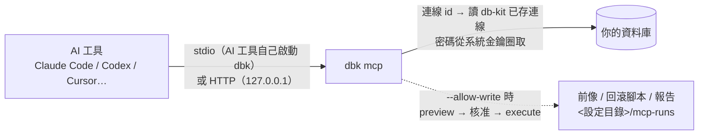
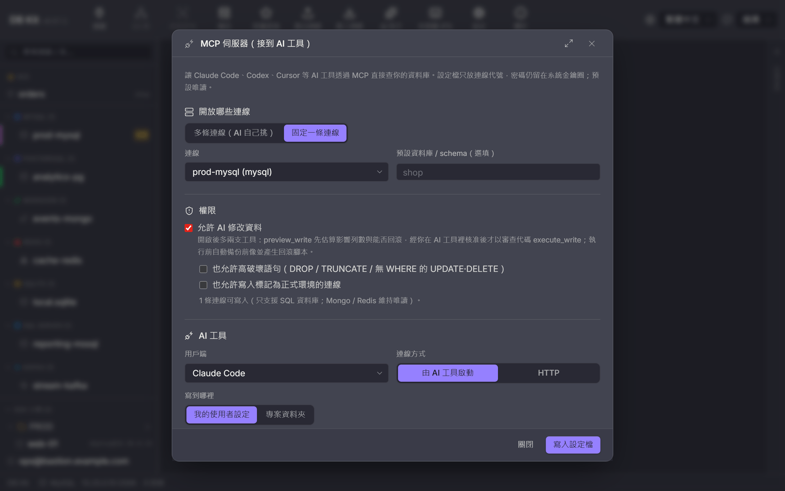
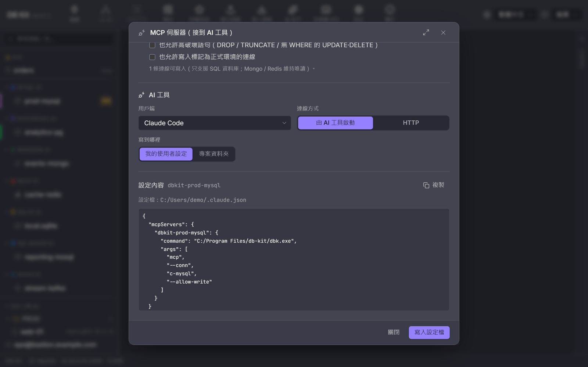

# MCP 伺服器：把資料庫接到 AI 工具

**繁體中文** · [English](./mcp.en.md)

`dbk mcp` 是一個 [Model Context Protocol](https://modelcontextprotocol.io) 伺服器：Claude Code、Codex、Cursor、VS Code（Copilot）、Claude Desktop、Windsurf 這些 AI 工具接上它之後，就能自己列出資料表、看欄位、查資料、看執行計畫——用的是你在 db-kit 存好的連線，密碼仍然只在系統金鑰圈裡。

預設**唯讀**。要讓 AI 改資料得在啟動時明確打開，而且每一次修改都走「審查並執行」：先預覽影響列數與能否回滾，你在 AI 工具裡核准後才執行，執行前自動備份、執行後留下回滾腳本。

- [一分鐘看懂](#一分鐘看懂)
- [在 App 裡設定（最快）](#在-app-裡設定最快)
- [用指令設定](#用指令設定)
- [單一連線與多連線](#單一連線與多連線)
- [提供的工具](#提供的工具)
- [讓 AI 修改資料](#讓-ai-修改資料)
- [HTTP 模式](#http-模式)
- [各 AI 工具的設定檔位置](#各-ai-工具的設定檔位置)
- [安全模型](#安全模型)
- [常見問題](#常見問題)

## 一分鐘看懂



| 你想要… | 做法 |
|---|---|
| 讓 AI 工具查某一個資料庫 | 連線右鍵 →「接到 AI 工具（MCP）…」→「寫入設定檔」 |
| 讓 AI 自己在多個資料庫之間挑 | 設定 →「設定 MCP…」→ 選「多條連線」 |
| 讓 AI 能改資料（每次都要你核准） | 勾「允許 AI 修改資料」 |
| 在伺服器 / CI 上用 | `dbk --conn shop mcp`，或 `dbk mcp install --client claude-code --yes` |

## 在 App 裡設定（最快）

兩個入口開的是同一個對話框：

- **連線右鍵 →「接到 AI 工具（MCP）…」**：預選這條連線。
- **設定 →「MCP 伺服器」→「設定 MCP…」**：預設多連線。

<p align="center"></p>

由上而下就是要做的決定：

1. **開放哪些連線**：固定一條（可指定預設資料庫 / schema），或多條讓 AI 自己挑（不勾 = 全部可用連線）。Kafka / Elasticsearch / 容器類連線 dbk 不支援，會自動略過。
2. **權限**：預設唯讀。勾「允許 AI 修改資料」後，可再分別允許高破壞語句（DROP / TRUNCATE / 無 WHERE 的 UPDATE·DELETE）與正式環境連線。下方會告訴你實際有幾條連線能寫。
3. **AI 工具與連線方式**：選用戶端；「由 AI 工具啟動」（stdio，建議）或「HTTP」（見 [HTTP 模式](#http-模式)）。支援專案層設定的工具可選寫到專案資料夾。
4. **設定內容**：下方即時顯示要寫進去的片段與設定檔位置，可以複製自己貼，或按「寫入設定檔」——原檔會先備份成 `<檔名>.dbkit-bak`，只改 db-kit 自己那一項，其他設定原樣保留。

<p align="center"></p>

寫完重新啟動那個 AI 工具就能用。已寫過的會標「已寫入」，按鈕變「更新設定檔」，左下角也能「從設定移除」。

## 用指令設定

`dbk mcp config` 印出片段（不寫檔），`dbk mcp install` 寫進設定檔：

```bash
# 印出 Cursor 的設定（多連線、唯讀）
dbk mcp config --client cursor

# 把 shop 這條連線寫進 Claude Code 的使用者設定，允許寫入
dbk --conn shop -d shop mcp install --client claude-code --allow-write          # 沒加 --yes：只印出將寫入的內容
dbk --conn shop -d shop mcp install --client claude-code --allow-write --yes    # 真的寫入（先備份原檔）

# 寫到專案資料夾（.mcp.json / .cursor/mcp.json / .vscode/mcp.json / .codex/config.toml）
dbk mcp install --client vscode --project . --yes
```

`--client`：`claude-code`、`codex`、`cursor`、`vscode`、`claude-desktop`、`windsurf`、`json`（通用 `mcpServers` 片段）。伺服器選項（`--connections`、`--tools`、`--allow-*`、`--out`）會原樣帶進設定；`--name` 改伺服器名稱（預設 `dbkit`，單一連線是 `dbkit-<連線名>`）；`--bin` 指定 dbk 路徑；`--http-url` 改成連到已在執行的 HTTP 伺服器。

設定檔**不放帳密**：只能用 `--conn <名稱>` 指向已存連線（寫進設定的是連線 id，改名不會斷），`--url` / `--kind` 臨時連線會被拒絕。

想手動加也可以：

```bash
claude mcp add --scope user dbkit -- dbk mcp
codex mcp add dbkit -- dbk mcp
```

## 單一連線與多連線

| | 單一連線 | 多連線 |
|---|---|---|
| 啟動 | `dbk --conn shop [-d shop] mcp`（或 `--url` / `--kind` 臨時連線） | `dbk mcp [--connections a,b]` |
| 工具參數 | 不用指定連線；`database` 省略時用 `-d` | 每支工具都要 `connection`（連線名稱）；AI 先呼叫 `list_connections` |
| 適合 | 專案只用一個資料庫、或 CI | 個人日常、要跨庫比對 |

多連線模式只讀設定檔列出連線，**用到哪條才連哪條**，連上後重用；`--connections` 是白名單（名稱或 id）。`list_connections` 會標出正式環境與可寫入的連線。

PostgreSQL 的工具參數 `database` 指的是 **schema**（與 db-kit 側欄一致）。連線本身設定的資料庫是「連到哪個庫」，不會被拿來當 schema——沒給 `-d` 時 AI 會先 `list_databases` 再指定。

## 提供的工具

| 工具 | 作用 | 何時有 |
|---|---|---|
| `list_connections` | 列出可用連線（名稱 / 種類 / 主機 / 預設庫 / 正式環境 / 可寫入） | 多連線模式 |
| `list_databases` | 列出資料庫 / schema | 一律 |
| `list_tables` | 列出資料表（含視圖） | 一律 |
| `describe_table` | 欄位、索引、外鍵 | 一律 |
| `sample_rows` | 前幾列樣本（上限 20 列） | 一律 |
| `run_query` | 唯讀查詢（上限 200 列 / 8 KB / 30 秒）；Mongo 用 JSON、Redis 用命令列 | 一律 |
| `explain_query` | 執行計畫 | SQL、Mongo |
| `list_routines` | 預存程序 / 函式 / 觸發器 | SQL |
| `get_ddl` | 表 / 視圖的 CREATE、程序 / 函式 / 觸發器的定義 | SQL |
| `compare_schema` | 兩個庫（可跨連線）的結構差異，可附同步 DDL——**只產生不執行** | SQL |
| `preview_write` | 預覽寫入：逐句影響列數、回滾能力、風險；回傳審查代碼 | `--allow-write` |
| `execute_write` | 以審查代碼執行預覽過的 SQL | `--allow-write` |

`--tools a,b` 只提供指定的工具（清單外的連呼叫都會被擋）。

## 讓 AI 修改資料

```bash
dbk --conn shop -d shop mcp --allow-write
```

AI 改資料的流程固定是兩步：

1. **`preview_write`**（`sql` 可以多句）：用「審查並執行」核心逐句分析——影響幾列、能不能完整回滾、有沒有沒 WHERE 的 UPDATE。這一步**不動任何資料**。通過就回一組 12 碼的審查代碼。
2. **`execute_write`**（只收審查代碼）：執行**伺服器端保存的那一份 SQL**——模型不可能預覽一段、執行另一段。執行前擷取前像、執行後擷取後像，回傳每句影響列數、差異摘要與回滾腳本開頭，完整的前像、`rollback.sql`、報告放在 `--out`（預設 `<設定目錄>/mcp-runs/`）。

AI 工具對每次工具呼叫都會請你核准，所以你會看到兩次：一次預覽、一次執行。看完預覽不同意，第二次按拒絕即可。

伺服器旗標是**硬上限**，模型改不了：

| 情況 | 需要 |
|---|---|
| 一般寫入（有 WHERE 的 UPDATE / DELETE、INSERT、可回滾的 DDL） | `--allow-write` |
| DROP / TRUNCATE / 無 WHERE 的 UPDATE·DELETE | 再加 `--allow-destructive` |
| 標記為正式環境的連線 | 再加 `--allow-prod` |
| 有語句無法完整回滾（例如影響列數超過前像擷取上限、DDL 沒有反向語句） | 模型在 `execute_write` 帶 `acknowledge_incomplete: true`——工具說明要求它先徵得你同意，核准畫面也看得到這個參數 |

審查代碼 15 分鐘失效、只能用一次。只支援 SQL 資料庫（MySQL / MariaDB / PostgreSQL / SQL Server / Oracle / SQLite）；Mongo / Redis 維持唯讀。`run_query` 遇到寫入語句一樣會擋，並提示改用 `preview_write`。

## HTTP 模式

stdio 是由 AI 工具自己把 dbk 當子程序啟動，最單純。需要讓多個工具共用一個伺服器、或工具只支援遠端 MCP 時，用 HTTP（MCP Streamable HTTP）：

```bash
DBKIT_MCP_TOKEN=<長隨機字串> dbk mcp --http 127.0.0.1:8765
# 用戶端連 http://127.0.0.1:8765/mcp，帶 Authorization: Bearer <token>
```

在 App 裡：MCP 設定選「HTTP」→「在背景啟動」。App 會產生並保存權杖（存在 `<設定目錄>/mcp-http.json`，以環境變數交給 dbk、不會出現在行程命令列），關掉 db-kit 時伺服器一起停止。執行中改了連線 / 權限選項會提示「套用選項並重啟」；「重新產生權杖」後已寫進 AI 工具的 HTTP 設定要再寫一次。

- 只聽本機時權杖可省略；**聽非本機位址（如 `0.0.0.0`）沒有權杖會拒絕啟動**。
- 帶 `Origin` 標頭的請求只接受 `localhost` / `127.0.0.1` / `[::1]` 來源，且不回任何 CORS 標頭：瀏覽器網頁（包括把網域解析到 127.0.0.1 的 DNS rebinding）打不進來。
- 每個 `initialize` 發一個 `Mcp-Session-Id`；`GET` 回 405（不提供伺服器推播串流），`DELETE` 結束 session。用戶端只收 SSE 時回應包成單一 SSE 事件。
- Codex 從環境變數 `DBKIT_MCP_TOKEN` 讀權杖（`bearer_token_env_var`），權杖不寫進 `config.toml`；其他工具的設定會直接含 `Authorization` 標頭——**別把那個檔案提交到版本控制**。Claude Desktop 的設定檔只收 stdio。

## 各 AI 工具的設定檔位置

| 用戶端 | 使用者層 | 專案層（`--project`） | 格式 |
|---|---|---|---|
| Claude Code | `~/.claude.json` | `.mcp.json` | `mcpServers`（`type: stdio / http`） |
| Codex | `~/.codex/config.toml`（或 `$CODEX_HOME`） | `.codex/config.toml` | `[mcp_servers.<名稱>]` |
| Cursor | `~/.cursor/mcp.json` | `.cursor/mcp.json` | `mcpServers` |
| VS Code | `<設定目錄>/Code/User/mcp.json` | `.vscode/mcp.json` | `servers`（`type: stdio / http`） |
| Claude Desktop | `<設定目錄>/Claude/claude_desktop_config.json` | — | `mcpServers`（只收 stdio） |
| Windsurf | `~/.codeium/windsurf/mcp_config.json` | — | `mcpServers`（HTTP 用 `serverUrl`） |

`<設定目錄>`：Windows `%APPDATA%`、macOS `~/Library/Application Support`、Linux `~/.config`。

寫入規則：只動 `mcpServers.<名稱>`（Codex 是 `[mcp_servers.<名稱>]` 與它的子表），其他內容與鍵序原樣保留；先備份成 `.dbkit-bak`，再以暫存檔 + rename 整檔替換。檔案含註解或尾逗號（VS Code 的 `mcp.json` 允許）時**不硬改**，會請你複製片段手動貼上。

## 安全模型

- **設定檔不放密碼**：連線以 id 指向 db-kit 已存連線，執行時才從系統金鑰圈取（與 GUI 同一份）。
- **預設唯讀**：SQL 走與 `dbk query` 同一道守門的嚴格版——連 `EXPLAIN ANALYZE DELETE …` 都擋（PostgreSQL 會真的執行內層語句）；MongoDB 拒絕 `$out` / `$merge`；Redis 只放行讀取類命令。**一次一條語句**。
- **寫入是兩段式、綁定 SQL、有硬上限**（見上）；每次寫入都有前像與回滾腳本。
- **守門在連線之前**：寫入語句或不准寫的連線，在撥連線之前就回錯誤，模型不會把「不准」誤讀成「連不上」而一直重試。
- **工具失敗回 `isError` 結果**而非協定錯誤，模型看得到原因並自行修正。
- **輸出有上限**：列數 / 位元組 / 逾時三道上限，一張寬表不會把整段對話擠掉。
- **HTTP**：預設只聽本機、非本機必須權杖、Origin 檢查、無 CORS。

App 內建的 AI 助手（右側面板）用的也是 `dbk mcp`，但永遠是單一連線、唯讀，不受這裡的設定影響。

## 常見問題

**AI 工具說找不到工具 / 伺服器啟動失敗。** 先在終端機跑一次設定裡的那行指令（例如 `dbk mcp`）：它應該印出「MCP 伺服器已啟動（stdio）」然後停著等輸入（Ctrl+C 結束）。找不到 dbk 就用 `--bin` 指定完整路徑，或在 App 裡設環境變數 `DB_KIT_DBK_BIN`。

**`codex exec` 呼叫工具失敗，說需要核准。** Codex 的非互動模式（`codex exec`）沒有核准畫面，MCP 工具呼叫會直接被拒；互動模式（直接執行 `codex`）會詢問，按允許即可。Claude Code 的 `claude -p` 則用 `--allowedTools mcp__dbkit__<工具>` 預先放行。

**哪些用戶端實測過？** Claude Code（`claude -p` 經 MCP 列表、查列數、看 DDL，答案與資料庫一致）與 Codex（握手、工具清單、呼叫都正常，非互動模式受上述核准限制）。其他用戶端只驗證了設定檔格式。

**`list_connections` 是空的。** 多連線模式只列 dbk 支援的種類（不含 Kafka / Elasticsearch / RabbitMQ / 容器類），也受 `--connections` 白名單限制。`dbk conn list` 可以看到全部已存連線。

**`execute_write` 一直說要 `acknowledge_incomplete`。** 預覽指出有語句無法完整回滾（例如前像超過擷取上限、或 DDL 沒有反向語句）。確認可以接受後，告訴 AI「我同意，繼續」即可。

**想讓整個團隊用。** 單一連線的設定寫的是**連線 id**，只在你這台有效。團隊共用的專案層設定請用多連線模式（`dbk mcp`，不綁 id），或把 `--conn` 手動改成連線名稱、大家各自建立同名連線。專案層設定**不要**開寫入權限，寫入請各自在使用者層打開。
