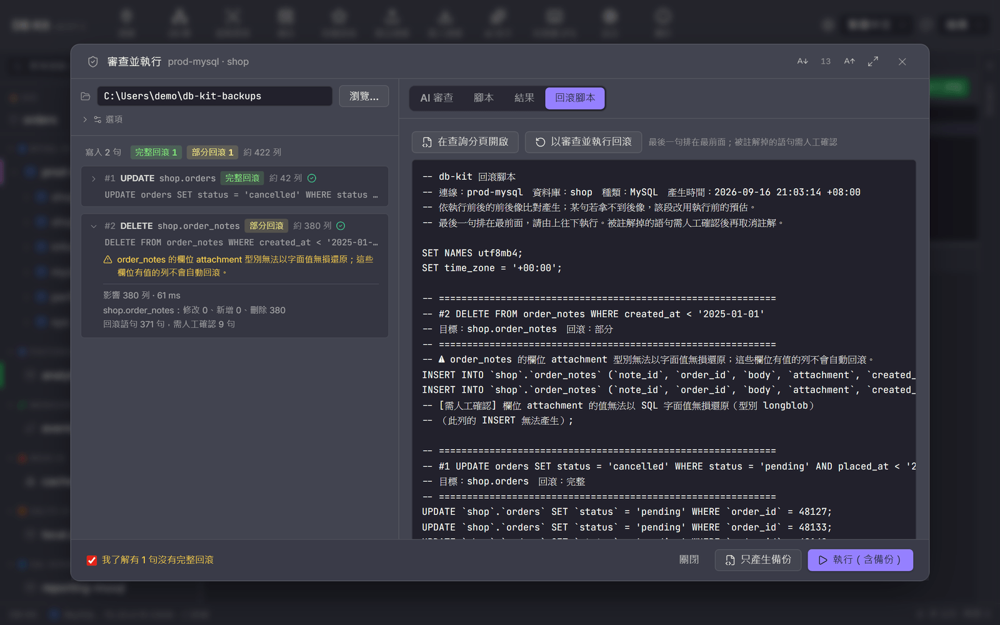
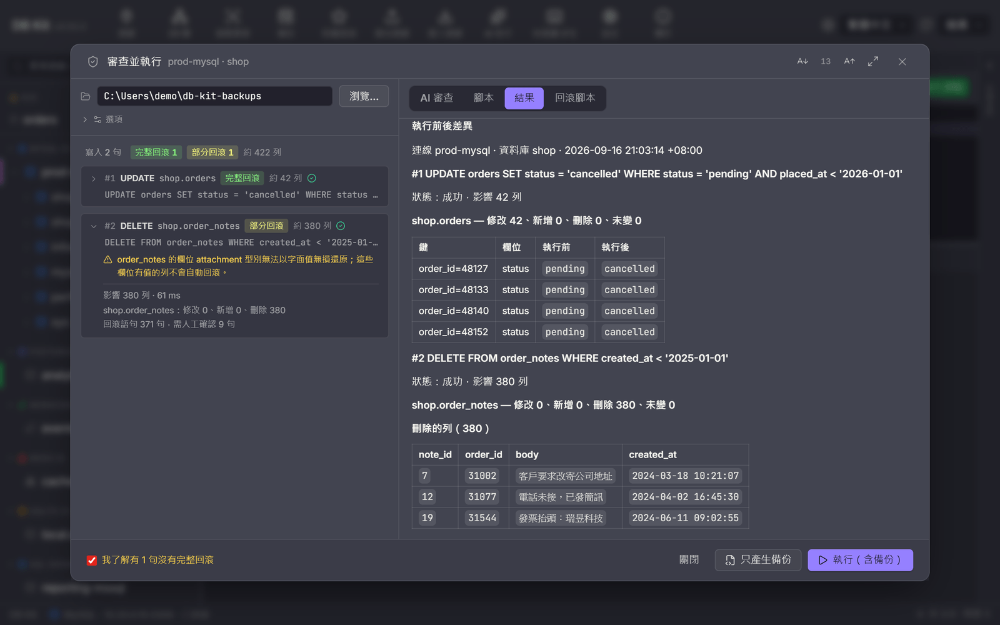

# Review & Run guide

[繁體中文](./review-run.md) · **English**

Before running a data-modifying SQL script against production, you usually want to know three things: **exactly which rows it will change**, **whether anything in it is wrong**, and **how to restore if something goes wrong**. "Review & Run" chains these three into a single workflow:

1. **DBA review**: The script, a per-statement analysis, the target table structures and estimated row counts are handed to a DBA persona (or several, for a panel review), which is asked to point out the expected before/after differences, risks and suggested fixes. While connected, the DBA uses read-only tools on its own to inspect structures and execution plans before reaching a conclusion.
2. **Per-statement backup**: **Before** each statement runs, the rows it will touch (the before-image) are captured, and the corresponding rollback statements are generated and written to a file.
3. **Execute and compare**: The statement is executed, then the same set of rows is captured again (the after-image) to compute the actual before/after differences.
4. **Everything goes into the directory you choose**: the script, the AI review, the rollback script, before/after-image snapshots and the diff report.

Supports MySQL, MariaDB, PostgreSQL, SQL Server, Oracle and SQLite. The desktop app and the `dbk run` command line use the same analysis, the same AI prompt and the same rollback generator.


---

## Where to open it

| Entry point | How |
|---|---|
| Query tab | The shield button "Review & Run" to the left of "Run" in the toolbar. If there is a highlighted selection, only the selection is processed; otherwise the whole editor content. Named parameters (`:name`) are prompted for first, as usual. |
| AI assistant | When you press "Run" on a SQL block in the conversation and it contains write statements, this dialog opens instead (read-only queries still run directly as before). |
| Command line | `dbk run script.sql --out <directory>`; see "Command line" below. |

**Just want to see which rows would change first?** In the query toolbar, "More → Preview affected rows…" uses the same analysis to rewrite each UPDATE / DELETE / INSERT as a read-only SELECT,
and lists the affected row count and the actual rows (up to 200). Nothing runs, nothing is sent to AI, and no files are written. An INSERT with explicit keys lists the existing rows it would collide with;
auto-numbered INSERTs and schema changes have no rows to show. When you're done, "Review & Run…" opens this dialog with the same SQL.

---

## Reading the dialog

**Left: statement analysis.** One row per statement, showing the statement type, target table, estimated affected rows and the **rollback level**:

| Level | Meaning |
|---|---|
| Full rollback | The before-image can be fully captured, and the rollback script can completely undo the effect of this statement. |
| Partial rollback | There is a rollback, but some rows or columns are not covered (e.g. a column type cannot be restored losslessly, or a table without a primary key can only have its deleted rows re-inserted). Expand the row to see why. |
| No rollback | This statement has no automatic rollback (calling a stored procedure, an UPDATE on a table without a primary key, affected rows exceeding the capture limit, ...). |
| No rollback needed | Statements such as SELECT that don't modify data. |

If any statement is "Partial" or "None", an extra checkbox "I understand that N statements have no full rollback" appears below, and must be checked before you can run. If the connection is marked as production, you have to check a second confirmation as well.

**Right: DBA review.** Sent automatically when the dialog opens (can be turned off under "Options"). The default persona depends on the connection: connections marked as production use "Production gatekeeper", others use "Senior DBA". Click a persona chip to switch; selecting several makes it a panel review (the combined verdict takes the strictest one). The first line is a verdict badge: **OK to run** / **Run after reviewing risks** / **Not recommended**. The structures and execution plans the DBA inspected are listed in the result; when "Before-image samples sent to AI" is 0, the DBA can only look at structures and plans and cannot fetch data. If AI isn't configured or fails, you can still continue; backup and rollback are unaffected. Personas and review templates can be adjusted in the AI library; see the [DBA review guide](./dba-review.en.md).

**Options:**

- **Capture limit per statement** (default 10,000 rows): If a statement would affect more rows than this, it cannot be fully backed up and is marked "No rollback".
- **Before-image samples sent to AI** (default 0): When greater than 0, the first few rows of actual data are sent to the AI provider along with everything else, so it can judge more accurately. **By default no data is sent**; only structures and row counts.

**The two buttons at the bottom:**

- **Backup only**: Only captures before-images and generates the review and rollback script, **without executing**. Useful for handing things to a DBA first, or for executing with another tool yourself. Also works on read-only connections (only read-only queries are sent).
- **Run (with backup)**: For each statement: "capture before-image → write rollback script → execute → capture after-image". Stops at the statement that hits an error. You can press "Cancel" while running; it stops after the current statement finishes.

---

## What's in the output directory

Each run creates a subdirectory under the directory you choose, named `time_connection_database`:

```
20260916-210000_prod-mysql_shop/
├── script.sql        The submitted script (with parameters substituted)
├── review.md         Full AI review (only if a review was done)
├── rollback.sql      Rollback script
├── diff.md           Before/after differences (execute mode only)
├── report.md         Summary: status, affected rows, rollback level and notes for each statement
├── manifest.json     Same as above, machine-readable
└── snapshots/
    ├── 01-before-orders.json   Before-image of statement 1 (full row data)
    ├── 01-after-orders.json    After-image of statement 1
    └── 03-schema-before-shop.json   Schema snapshot for a DDL statement
```

### rollback.sql

- **The last statement comes first**, so running it top to bottom is the correct restore order.
- One section per statement; the comment at the top of each section shows the original statement, the target table and the rollback level.
- Within a section the order is always DELETE (remove rows this statement inserted) → UPDATE (write back old values) → INSERT (re-insert deleted rows). Unique keys are freed before values are written back, so secondary unique indexes don't collide.
- **Any statement that cannot be safely restored with certainty is commented out**, prefixed with `-- [Review manually]` and the reason (e.g. "after the UPDATE this row can no longer be found by primary key; re-inserting it may create duplicate data"). Review these before deciding whether to uncomment them.
- In execute mode, the rollback fragment is written to the file **before each statement runs**. If the connection drops or the app is closed midway, the file still contains the rollback up to and including that statement (the file header is marked `[IN PROGRESS]`).
- Settings in the file header such as `SET time_zone` / `SET DateStyle` ensure the values are interpreted correctly; run them as well.



To restore, the Results tab has two buttons: **Open rollback script in a query tab**, or **Run rollback via Review & Run**. The latter runs this same workflow on the rollback script itself, which means the "current state" is backed up before restoring.

### diff.md

One section per statement, listing modified rows (per column, before / after), inserted rows and deleted rows. Beyond 200 rows only the first 200 are listed; the full data is in `snapshots/`. The dialog's "Results" tab shows this diff directly:



---

## Statements that are blocked

The following statements prevent the whole script from going through this workflow (not a single statement is executed). Remove them, or run them from a query tab instead:

| Statement | Reason |
|---|---|
| `BEGIN` / `COMMIT` / `ROLLBACK` / `SAVEPOINT` | This workflow auto-commits each statement. db-kit connections are pooled, so transaction-control statements would land on different connections and leave one connection with an open transaction. |
| `USE` / `SET …` / `DECLARE` / temporary tables / `LOCK TABLES` | Same reason: session state is not guaranteed to carry over to the next statement. To switch databases, use the database selector in the query tab. |
| `CREATE PROCEDURE / FUNCTION / TRIGGER` on anything other than PostgreSQL | Semicolons inside the `BEGIN … END` body make per-statement splitting unreliable. |
| `DROP DATABASE` / `DROP SCHEMA` | There is no single object to capture; take a full dump with "Backup" first. |
| Still contains `:name` parameters | Substitute them first. |

Exception: the few `SET` statements in the rollback script header (whose values are the same as what the db-kit connection already sets) and SQL Server `SET IDENTITY_INSERT … ON / OFF` batches are recognized, so the rollback script itself can go through Review & Run again.

---

## How each statement type is backed up

| Statement | Before-image | Rollback |
|---|---|---|
| `UPDATE … WHERE` | Captures rows of the target table using the original statement's FROM / JOIN / WHERE | Writes back **the columns that actually changed**, by primary key (requires a primary key or a unique key whose columns are all NOT NULL) |
| `DELETE … WHERE` | Same as above | INSERTs the deleted rows back (works without a primary key too) |
| `INSERT … VALUES` (explicit keys) | Captures by those keys (an upsert overwrites existing rows) | Deletes the inserted rows and writes back the overwritten ones |
| `INSERT` (auto-increment) | Records the maximum key before execution | Deletes rows "greater than that value"; if the count doesn't match the number of inserted rows reported by the statement (another connection wrote concurrently), all DELETEs are changed to need manual confirmation |
| `INSERT … SELECT` (non-integer key) / `MERGE` / `LOAD DATA` / `TRUNCATE` | The whole table (subject to the capture limit) | Compares the whole table before/after by primary key |
| `ALTER TABLE` / `CREATE / DROP INDEX` / `CREATE / DROP TABLE` / views | Object structure (same capture as Schema compare); dropping a column, changing a type and DROP TABLE additionally capture the whole table's data | Reverse DDL (reusing Schema compare's sync DDL generator) + data write-back |
| `ALTER TABLE … RENAME` / `RENAME TABLE` | — | Generates the reverse RENAME directly |
| `CALL` / `EXEC`, writable CTEs, `GRANT` / `REVOKE` | — | None (can only run after confirmation) |

Statements that modify via a JOIN (`UPDATE a JOIN b …`, `DELETE a FROM a JOIN b …`, `UPDATE … FROM`, `DELETE … USING`) are de-duplicated by primary key, and their estimated row count is marked as an upper bound (≤). A single statement that modifies two tables at once (`DELETE a, b FROM …`) cannot be rolled back.

---

## How values are preserved exactly

The worst failure for a rollback script isn't "failed to generate"; it's "ran successfully, but wrote back the wrong values". That's why the before-image is **not** captured with `SELECT *`, which is meant for display: binary values keep only the first 64 bytes, Oracle CLOBs are truncated at 4 KB, and timestamps carry display-only suffixes.

Every column is rewritten into an expression whose text form round-trips losslessly, and captured that way:

| Database | Approach |
|---|---|
| MySQL / MariaDB | Binary via `HEX()` → `X'…'`; BIT converted to integer; spatial types stored as SRID + WKB; everything else `CAST(… AS CHAR)`. The rollback script header has `SET time_zone = '+00:00'` (the time zone used at capture). |
| PostgreSQL | Always `::text`: each type's text output is exactly its canonical input format (bytea, arrays, jsonb, interval, timestamptz with time zone). Header sets `SET DateStyle / TimeZone / standard_conforming_strings`. GENERATED ALWAYS identity columns get `OVERRIDING SYSTEM VALUE` automatically. |
| SQL Server | Date/time values use ISO 8601 (unaffected by language and DATEFORMAT), datetimeoffset keeps the original time-zone offset, float uses 17 significant digits, binary uses `0x…`, geography / geometry are stored as WKT + SRID. INSERTs into identity columns are wrapped in a single `SET IDENTITY_INSERT ON … OFF` batch (no semicolons in between, guaranteeing the same connection). Computed columns and rowversion are not written back. |
| Oracle | DATE / TIMESTAMP / TIMESTAMP WITH TIME ZONE use fixed-format `TO_CHAR` ↔ `TO_DATE / TO_TIMESTAMP(_TZ)`; RAW uses `RAWTOHEX` ↔ `HEXTORAW`; BLOBs up to 2,000 bytes and CLOBs up to 1,000 characters can be restored, longer ones are marked as not restorable. |
| SQLite | Records each value's storage class with `typeof()`; REAL uses 17 significant digits; BLOB uses `hex()`. |

Values that can't be preserved losslessly (SQL Server sql_variant, very long LOBs, Oracle object types such as XMLTYPE, etc.) are not silently written as NULL; instead, that row's rollback statement is commented out with the reason noted.

---

## Command line

```bash
# Dry run: analyze + capture before-images + generate review and rollback script, without executing (no --yes)
dbk --conn prod-mysql -d shop run migrate.sql --out D:/db-backups

# Review with an external AI command: the prompt is fed via stdin, stdout is saved as review.md
dbk --conn prod-mysql -d shop run migrate.sql --out D:/db-backups --review-cmd "claude -p"

# Execute (add --force as well for DROP / TRUNCATE / writes without WHERE)
dbk --conn prod-mysql -d shop run migrate.sql --out D:/db-backups --yes

# Only print the review prompt, and pipe it into any AI tool yourself
dbk --conn prod-mysql -d shop run migrate.sql --out D:/db-backups --print-prompt > prompt.md
```

| Flag | Description |
|---|---|
| `--out`, `-o` | Output directory (required) |
| `--review-cmd <CMD>` | AI review command. When the AI says "Not recommended" (STOP), by default only the backup is generated and nothing is executed |
| `--persona <NAME,…>` | DBA review persona(s) (names from the AI library); comma-separated multiple = panel review, verdict takes the strictest. When omitted, the default is chosen based on whether the connection is production |
| `--ignore-verdict` | Execute even when the AI says STOP |
| `--review-samples <N>` | Number of before-image sample rows sent to the AI (default 0, no data sent) |
| `--print-prompt` | Only print the review prompt, then exit |
| `--max-capture-rows <N>` | Capture limit per statement (default 10,000) |
| `--allow-incomplete` | Execute even if some statements have no full rollback |
| `--allow-prod` | Required to execute when the connection is marked as production |

On PostgreSQL, `-d` is the schema; when omitted, the connection's `current_schema()` is used. On SQL Server and Oracle, unqualified table names always resolve to the connection's default database / schema (as reported by the server). Exit codes: 0 for success or backup-only; non-zero for execution failure, abort or cancel. `--format json` outputs the directory path and the full manifest.

---

## Limitations and caveats

- **It is not a transaction.** Each statement commits on its own; if statement 3 fails, statements 1 and 2 have already taken effect. That is exactly why the rollback script exists.
- **Side effects from triggers and cascading deletes (ON DELETE CASCADE) are not in the before-image.** The AI review is asked to point out this kind of risk, but the rollback script only covers tables the statements directly target.
- **If another connection writes to the same rows during execution**, the rollback will overwrite those changes too. Auto-increment INSERTs have a count check; other statements don't.
- If a `WHERE` in the script calls a function with side effects, it runs one extra time while capturing the before-image.
- Before-image queries are always sent only after passing a strict read-only check; Backup-only mode sends only read-only queries.
- In review mode, API-based AI providers don't save the conversation history to the settings directory (the prompt may contain sample data).
- **Real-database verification scope**: MySQL 8.4, PostgreSQL 16, SQL Server 2022 and SQLite have all been verified with end-to-end tests of "execute → apply rollback → byte-for-byte comparison of the whole table"; **Oracle has not been tested yet**; its implementation follows the official documentation.
