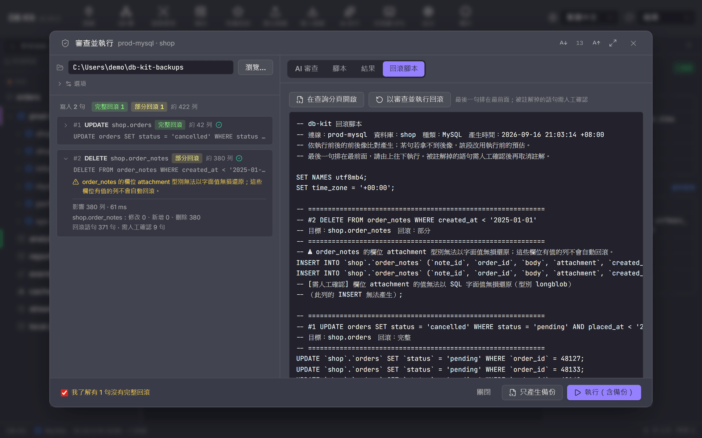

# 審查並執行使用指南

在正式環境跑一份會改資料的 SQL 腳本之前，你通常會想先知道三件事：**它到底會改到哪些列**、**有沒有寫錯的地方**、**出事了怎麼還原**。「審查並執行」把這三件事串成一個流程：

1. **AI 審查**：把腳本、逐句分析、目標表結構與估算列數交給 AI，請它指出預期的前後差異、風險與修正建議。
2. **逐句備份**：每一句執行**之前**，先把它會動到的列（前像）抓下來，產生對應的回滾語句並寫進檔案。
3. **執行並比對**：執行那一句，再抓一次同一批列（後像），比出實際的前後差異。
4. **全部寫進你指定的目錄**：腳本、AI 審查、回滾腳本、前後像快照、差異報告。

支援 MySQL、MariaDB、PostgreSQL、SQL Server、Oracle、SQLite。桌面 App 與命令列 `dbk run` 用的是同一套分析、同一份 AI 提示、同一個回滾產生器。


---

## 從哪裡開

| 入口 | 做法 |
|---|---|
| 查詢分頁 | 工具列「執行」左邊的盾牌鈕「審查並執行」。有反白選取時只處理選取段，否則整段。具名參數（`:name`）會先照常提示輸入。 |
| AI 助手 | 對話裡的 SQL 區塊按「執行」時，若含寫入語句，會改開這個對話框（唯讀查詢照舊直接執行）。 |
| 命令列 | `dbk run script.sql --out <目錄>`，見下方〈命令列〉。 |

---

## 對話框怎麼看

**左邊：語句分析。** 每一句一列，標出語句類型、目標表、估算影響列數，以及**回滾等級**：

| 等級 | 意思 |
|---|---|
| 完整回滾 | 前像能完整抓到，回滾腳本可以把這句的效果整個撤掉。 |
| 部分回滾 | 有回滾，但有些列或欄位不在涵蓋範圍（例如某欄型別無法無損還原、沒有主鍵的表只能補回被刪的列）。展開那一列看原因。 |
| 無回滾 | 這句沒有自動回滾（呼叫預存程序、沒有主鍵的 UPDATE、受影響列數超過擷取上限…）。 |
| 不需回滾 | SELECT 之類不改資料的語句。 |

有任何一句是「部分」或「無」，下方會多一個勾選框「我了解有 N 句沒有完整回滾」，勾了才能執行。連線標記為正式環境時還要再勾一次。

**右邊：AI 審查。** 開啟對話框時自動送出（可在「選項」關掉）。第一行是結論徽章：**可以執行** / **注意風險後再執行** / **不建議執行**。AI 沒設定或失敗也可以繼續，備份與回滾不受影響。

**選項：**

- **每句擷取上限**（預設 10,000 列）：一句會影響的列數超過這個數字，就無法完整備份，那句會被標成「無回滾」。
- **附前像樣本給 AI**（預設 0）：大於 0 時會把前幾列實際資料一起送給 AI 供應商，讓它判斷得更準。**預設不送任何資料**，只送結構與列數。

**底部兩個按鈕：**

- **只產生備份**：只抓前像、產生審查與回滾腳本，**不執行**。適合先把東西交給 DBA 看，或自己用別的工具執行。唯讀連線也可以用（只送唯讀查詢）。
- **執行（含備份）**：逐句「抓前像 → 寫入回滾腳本 → 執行 → 抓後像」。遇到錯誤就停在那句。執行中可以按「取消」，會在目前這句結束後停下。

---

## 輸出目錄裡有什麼

每次在你選的目錄底下建一個子目錄，名稱是 `時間_連線名_資料庫`：

```
20260916-210000_prod-mysql_shop/
├── script.sql        送出去的腳本（已代入參數）
├── review.md         AI 審查全文（有審查才有）
├── rollback.sql      回滾腳本
├── diff.md           執行前後差異（執行模式才有）
├── report.md         摘要：每句的狀態、影響列數、回滾等級、注意事項
├── manifest.json     同上，機器可讀
└── snapshots/
    ├── 01-before-orders.json   第 1 句的前像（整列資料）
    ├── 01-after-orders.json    第 1 句的後像
    └── 03-schema-before-shop.json   DDL 語句的結構快照
```

### rollback.sql

- **最後一句排在最前面**，由上往下執行就是正確的還原順序。
- 每句一段，段首註解寫著原本的語句、目標表與回滾等級。
- 同一段內的順序固定是 DELETE（移除這句新增的列）→ UPDATE（寫回舊值）→ INSERT（補回被刪的列），先騰出唯一鍵再寫回，不會撞到次要唯一索引。
- **不確定能安全還原的語句一律被註解掉**，前面標 `-- [需人工確認]` 並寫明原因（例如「UPDATE 之後依主鍵找不到這列，補回可能造成重複資料」）。請看過再決定要不要取消註解。
- 執行模式下，回滾片段在**每句執行前**就先寫進檔案。執行到一半斷線或 App 被關掉，檔案裡仍有涵蓋到那句為止的回滾（檔頭會標【執行中】）。
- 檔頭的 `SET time_zone` / `SET DateStyle` 等設定是讓值被正確解讀用的，請一起執行。



要還原時，結果分頁有兩個按鈕：**在查詢分頁開啟回滾腳本**，或 **以審查並執行回滾**——後者會對回滾腳本本身再走一次這個流程，也就是還原之前先把「現在的狀態」備份起來。

### diff.md

每句一節，列出修改（逐欄的執行前 / 執行後）、新增與刪除的列。超過 200 列只列前 200 列，完整資料在 `snapshots/`。對話框的「結果」分頁會直接顯示這份差異：


---

## 哪些語句會被擋下

以下語句會讓整份腳本不能走這個流程（一句都不會執行），請移除或改在查詢分頁執行：

| 語句 | 原因 |
|---|---|
| `BEGIN` / `COMMIT` / `ROLLBACK` / `SAVEPOINT` | 本流程逐句自動提交。db-kit 的連線是連線池，交易控制語句會落在不同連線上，留下一條開著交易的連線。 |
| `USE` / `SET …` / `DECLARE` / 暫存表 / `LOCK TABLES` | 同理，session 狀態不保證帶到下一句。要切資料庫請用查詢分頁的資料庫選擇器。 |
| 非 PostgreSQL 的 `CREATE PROCEDURE / FUNCTION / TRIGGER` | `BEGIN … END` 本體裡的分號讓逐句切分不可靠。 |
| `DROP DATABASE` / `DROP SCHEMA` | 沒有單一物件可以擷取，請先用「備份」做完整傾印。 |
| 仍含 `:name` 參數 | 請先代入。 |

例外：回滾腳本檔頭那幾句 `SET`（值與 db-kit 連線本來就設定的相同）與 SQL Server 的 `SET IDENTITY_INSERT … ON / OFF` 批次會被認得，所以回滾腳本本身可以再走一次審查並執行。

---

## 各種語句怎麼備份

| 語句 | 前像 | 回滾 |
|---|---|---|
| `UPDATE … WHERE` | 依原語句的 FROM / JOIN / WHERE 抓目標表的列 | 依主鍵把**實際改過的欄位**寫回（需要主鍵或全 NOT NULL 的唯一鍵） |
| `DELETE … WHERE` | 同上 | 把刪掉的列 INSERT 回去（沒有主鍵也可以） |
| `INSERT … VALUES`（明確給鍵） | 依那些鍵抓（upsert 會覆寫既有列） | 刪掉新增的、寫回被覆寫的 |
| `INSERT`（自動編號） | 記下執行前最大鍵 | 刪掉「大於那個值」的列；若數量與語句回報的新增列數對不上（有別的連線同時寫入），DELETE 全部改為需人工確認 |
| `INSERT … SELECT`（非整數鍵）/ `MERGE` / `LOAD DATA` / `TRUNCATE` | 整張表（受擷取上限限制） | 依主鍵比對前後整表 |
| `ALTER TABLE` / `CREATE / DROP INDEX` / `CREATE / DROP TABLE` / 視圖 | 物件結構（與結構比對同一套擷取）；刪欄、改型別、DROP TABLE 另抓整表資料 | 反向 DDL（沿用結構比對的同步 DDL 產生器）+ 資料寫回 |
| `ALTER TABLE … RENAME` / `RENAME TABLE` | — | 直接產生反向的 RENAME |
| `CALL` / `EXEC`、可寫 CTE、`GRANT` / `REVOKE` | — | 無（需確認後才能執行） |

一句裡用 JOIN 去改的語句（`UPDATE a JOIN b …`、`DELETE a FROM a JOIN b …`、`UPDATE … FROM`、`DELETE … USING`）會依主鍵去重，估算列數標成上限（≤）。一句同時改兩張表的寫法（`DELETE a, b FROM …`）無法回滾。

---

## 值怎麼保證原封不動

回滾腳本最怕的不是「產生失敗」，而是「成功執行、但寫回去的值是錯的」。所以前像**不是**用 `SELECT *` 抓——那是給畫面用的：二進位只留前 64 bytes、Oracle CLOB 截在 4 KB、時間戳帶顯示用的後綴。

每個欄位都改寫成文字形式可無損往返的運算式再抓：

| 資料庫 | 做法 |
|---|---|
| MySQL / MariaDB | 二進位用 `HEX()` → `X'…'`；BIT 轉整數；空間型別存 SRID + WKB；其餘 `CAST(… AS CHAR)`。回滾腳本檔頭 `SET time_zone = '+00:00'`（抓取時的時區）。 |
| PostgreSQL | 一律 `::text`——每個型別的文字輸出就是它的標準輸入格式（bytea、陣列、jsonb、interval、timestamptz 含時區）。檔頭 `SET DateStyle / TimeZone / standard_conforming_strings`。GENERATED ALWAYS identity 自動加 `OVERRIDING SYSTEM VALUE`。 |
| SQL Server | 日期時間用 ISO 8601（不受語系與 DATEFORMAT 影響）、datetimeoffset 保留原始時區位移、float 用 17 位有效數字、binary 用 `0x…`、geography / geometry 存 WKT + SRID。identity 欄的 INSERT 包成一個 `SET IDENTITY_INSERT ON … OFF` 批次（中間不放分號，確保同一條連線）。計算欄與 rowversion 不寫回。 |
| Oracle | DATE / TIMESTAMP / TIMESTAMP WITH TIME ZONE 用固定格式的 `TO_CHAR` ↔ `TO_DATE / TO_TIMESTAMP(_TZ)`；RAW 用 `RAWTOHEX` ↔ `HEXTORAW`；2,000 bytes 以內的 BLOB 與 1,000 字元以內的 CLOB 可還原，更長的標為無法還原。 |
| SQLite | 以 `typeof()` 記下每個值的儲存類別；REAL 用 17 位有效數字；BLOB 用 `hex()`。 |

做不到無損的值（SQL Server 的 sql_variant、超長 LOB、Oracle 的 XMLTYPE 等物件型別）不會被寫成 NULL 蒙混過去，而是那一列的回滾語句被註解掉並註明原因。

---

## 命令列

```bash
# 預演：分析 + 擷取前像 + 產生審查與回滾腳本，不執行（沒帶 --yes）
dbk --conn prod-mysql -d shop run migrate.sql --out D:/db-backups

# 用外部 AI 指令審查：提示從 stdin 餵入，stdout 存成 review.md
dbk --conn prod-mysql -d shop run migrate.sql --out D:/db-backups --review-cmd "claude -p"

# 執行（含 DROP / TRUNCATE / 無 WHERE 寫入時再加 --force）
dbk --conn prod-mysql -d shop run migrate.sql --out D:/db-backups --yes

# 只印出審查提示，自己接到任何 AI 工具
dbk --conn prod-mysql -d shop run migrate.sql --out D:/db-backups --print-prompt > prompt.md
```

| 旗標 | 說明 |
|---|---|
| `--out`, `-o` | 輸出目錄（必填） |
| `--review-cmd <CMD>` | AI 審查指令。AI 判「不建議執行」（STOP）時預設只產生備份、不執行 |
| `--ignore-verdict` | AI 判 STOP 時仍執行 |
| `--review-samples <N>` | 附給 AI 的前像樣本列數（預設 0，不送資料） |
| `--print-prompt` | 只印出審查提示後結束 |
| `--max-capture-rows <N>` | 每句擷取上限（預設 10,000） |
| `--allow-incomplete` | 有語句沒有完整回滾仍執行 |
| `--allow-prod` | 連線標記為正式環境時必須加上才執行 |

`-d` 在 PostgreSQL 是 schema；沒給時用連線的 `current_schema()`。SQL Server 與 Oracle 的未限定表名一律落在連線的預設資料庫 / schema（以伺服器回報為準）。結束碼：成功或只備份為 0；執行失敗、中止、取消為非 0。`--format json` 會輸出目錄路徑與完整的 manifest。

---

## 限制與注意事項

- **不是交易**。每句各自提交；第 3 句失敗時，前 2 句已經生效——這正是回滾腳本存在的理由。
- **觸發器與串接刪除（ON DELETE CASCADE）的連帶變更不在前像裡**。AI 審查會被要求指出這類風險，但回滾腳本只涵蓋語句直接指向的表。
- **執行期間別的連線同時寫入同一批列**，回滾會把那些變更一起蓋掉。自動編號 INSERT 有數量核對，其他語句沒有。
- 腳本裡的 `WHERE` 若呼叫有副作用的函式，擷取前像時會多執行一次。
- 前像查詢一律通過嚴格唯讀檢查才送出；只產生備份模式只送唯讀查詢。
- API 型 AI 供應商在審查模式下不會把對話歷史存到設定目錄（提示可能夾帶樣本資料）。
- **實機驗證範圍**：MySQL 8.4、PostgreSQL 16、SQL Server 2022、SQLite 都以「執行 → 套用回滾 → 整表逐位元組比對」的端到端測試驗過；**Oracle 尚未實測**，做法依官方文件撰寫。
